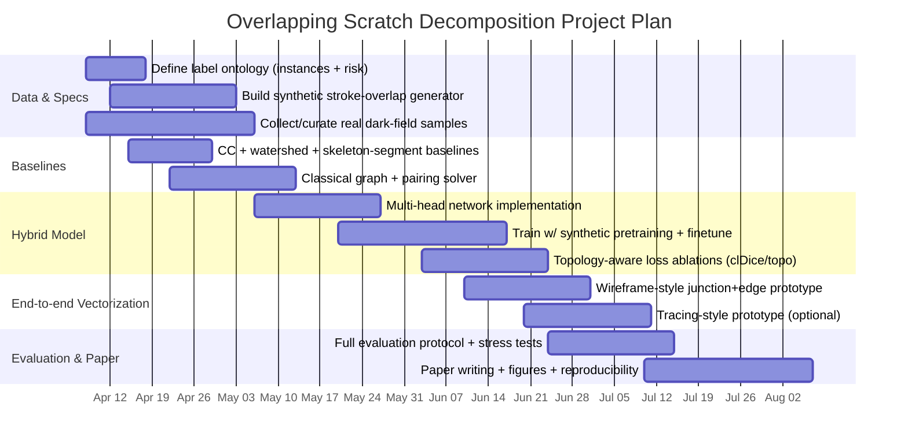

# Algorithmic Design for Decomposing Overlapping Scratches in Dark-Field Microstructured Lens Inspection

## Executive summary

You already have a reliable **foreground extraction** stage (thresholding on dark-field images), but the industrial—and publishable—core problem is **post-segmentation structural reasoning**: decomposing one connected, thin-structure mask into a set of **individual scratch instances** (ideally as **vectorized curves**) and producing **region-level risk classification** in dense overlap zones.

This report synthesizes primary research on thin-structure analysis (cracks, vessels, neurites, roads, wireframes), and then proposes three concrete algorithm designs suitable for an industrial system and a paper contribution:

- A **classical skeleton → graph → junction pairing** pipeline with principled costs (angle/width/intensity/curvature) and explicit handling of ill-posed dense overlap via a “risk region” output.
- A **hybrid learned multi-head** network (predicting skeleton/junction/orientation/width + uncertainty) coupled with the same graph solver, enabling robustness under realistic noise and blur while keeping outputs interpretable and vectorized.
- An **end-to-end vectorized tracing** approach inspired by wireframe parsing and road graph extraction, producing polylines/graphs directly when you can afford vector supervision.

The most robust practical path for “publishable + deployable” is typically the **hybrid multi-head + graph solver**, with a strong ablation plan showing why each head and each solver term matters, and why topology-aware objectives improve connectivity fidelity (vs. simple IoU). This aligns with established conclusions in vessel tracing (the real bottleneck is crossover reasoning) and road extraction (pixel masks alone do not ensure correct connectivity). citeturn7search0turn5search0

A critical enabler is data: you can bootstrap overlapping-scratch decomposition labels using **synthetic overlap generation** from stroke-like datasets (e.g., online handwriting trajectories or vector doodles) and/or **scratch-specific synthesis** methods that generate realistic annotated scratches. citeturn2view0turn2view2turn2view3turn1search3

Unspecified in your request (treated as unknown constraints): image resolution and field-of-view, defect density distribution across production lots, real-time latency budget, hardware limits, whether “scratch instances” need physical continuity at crossings, and the operational definition of “risk” (yield loss vs. cosmetic reject vs. downstream failure).

## Problem statement and assumptions

### Task definition

**Input**:  
- Dark-field image \(I\) (grayscale or RGB), unspecified resolution.  
- A **foreground defect mask** \(M\) (binary or probabilistic) from thresholding (already working), depicting *all* defect pixels (scratches + spots + damage clusters).

**Desired outputs**:
1) A set of **scratch instances** \(\{S_k\}\), where each instance is preferably a **vectorized curve** (polyline/spline) and optionally also a raster mask.  
2) A **region-level risk map** \(R(x,y)\) or region labels (e.g., “critical overlap zone”) for locations where instance decomposition is ambiguous or operationally unnecessary (dense entanglement).

### Why this is not standard instance segmentation

At scratch crossings, pixels may be explained by **multiple underlying curves**. Pure pixel-to-instance assignment can become ill-posed at intersections, motivating curve/graph representations rather than mask instances alone. This is analogous to “crossover issues” in vessel tracing, where deciding which segments belong to which tree at junctions is the core difficulty. citeturn7search0

### Imaging/inspection context

Dark-field optical inspection often yields defects that are brighter than the background, making threshold segmentation viable; published optical-device dark-field work explicitly uses threshold segmentation due to this intensity separation and then classifies defects into point vs line types. citeturn1search1  
Deep models exist for weak scratch segmentation on optical surfaces, but segmentation alone does not solve the structural decomposition problem when overlaps are dense. citeturn1search0

## Related work landscape mapped to your problem

### Thin-structure segmentation and crack literature

Crack detection/segmentation work (e.g., DeepCrack) targets thin elongated structures with discontinuities and clutter, using multi-scale features and post-refinement (e.g., guided filtering/CRF). It provides useful architectures and evaluation framing for line-like defects, but it generally outputs **a crack mask**, not decomposed curve instances. citeturn6search0

### Vessel tracing and crossover reasoning

Vessel tracing literature is unusually aligned with your need: it separates (i) segmentation aimed at **connectivity-preserving high recall** from (ii) a tracing stage that explicitly handles junction ambiguity. A representative approach constructs a skeleton graph and frames crossover separation as graph-based inference with both local and global context. citeturn7search0turn7search4

Key transferable idea: treat your scratch mask as a **network**, convert it to a graph, and solve “which branches belong together” using orientation continuity and context—exactly the operation you need at scratch crossings. citeturn7search0

### Topology-aware metrics and losses

For tubular/network structures, IoU/Dice can miss connectivity failures (broken links). clDice defines a skeleton-focused similarity and provides a differentiable loss (soft-clDice) that improves connectivity and graph-based measures. citeturn5search2  
Persistent-homology-based topological losses (NeurIPS’ topology-preserving segmentation; and related topological-prior work) formalize topology discrepancies and can provide gradients targeted at broken connections and incorrect components. citeturn5search3turn7search3turn7search7

These are directly relevant for:  
- training any learned refinement/skeleton head, and  
- defining evaluation metrics that correlate with your “instance decomposition correctness.”

### Wireframe parsing and vectorized line extraction

L-CNN (end-to-end wireframe parsing) targets exactly what you want as an output representation: **junctions + connectivity** → vectorized lines, designed to avoid heuristic line extraction. citeturn5search1  
This framework is attractive when you can annotate junctions/lines (vector supervision) and want direct polylines.

### Road network extraction and graph-first reasoning

RoadTracer argues segmentation→heuristics pipelines fail because connectivity decisions are delegated to brittle post-processing; it instead constructs the road graph iteratively with a learned decision function and shows improved junction capture. citeturn5search0  
The core lesson for scratches: if you need robust connectivity/instance curves, treat the output as a **graph prediction** problem, not only pixel labeling.

Road graph extraction also offers graph metrics like APLS (Average Path Length Similarity) used in SpaceNet-style evaluation, which can be adapted to scratch graphs when you produce vectorized networks. citeturn8search0turn8search4

### Instance segmentation, embedding, watershed, and amodal approaches

- **Mask R-CNN** is a foundational instance segmentation method, but it assumes objects are separable instances and is not designed for thin, massively crossing line structures. citeturn4search4turn4search0  
- **InstanceCut (MultiCut)** combines semantic masks and boundaries to globally partition into instances—useful conceptual grounding for “boundary + global partition,” but still challenged by true crossings where boundaries are ambiguous. citeturn4search5  
- **Discriminative embedding losses** cluster pixels into instances; this can help for touching objects but still struggles when crossing pixels should support multiple underlying curves. citeturn6search2turn6search6  
- **Deep Watershed Transform** learns an energy landscape where instances become basins; helpful for blob-like instance splits, less natural for line crossings. citeturn6search1  
- **Amodal instance segmentation** addresses occlusion completion; conceptually relevant to “multiple underlying objects,” but typically label-expensive and not the most direct formulation for scratch networks. citeturn6search3

## Engineering baselines, evaluation metrics, and method comparison tables

### Baselines you should implement first

These baselines are needed for both engineering sanity and publishable ablations:

1) **Connected components as instances**: fast; fails immediately under overlaps crossings.  
2) **Connected components + marker watershed**: improves blob separation; often over/under-splits thin lines depending on marker quality. Watershed is a classic immersion-based morphology method with strong implementations and graph extensions. citeturn7search1  
3) **Skeleton segments as instances**: each segment between junctions is an “instance”; over-segments but provides a lower bound.  
4) **No pairing vs heuristic pairing**: pairing at junctions via angle continuity as a baseline for “instance assembly.”
5) **Segmentation-only deep baseline** (optional): demonstrates that better masks do not equal correct instance decomposition in dense overlaps—this mirrors arguments in road extraction and vessel tracing. citeturn5search0turn7search0

### Evaluation protocol (what to measure and how)

A publishable protocol should separate three goals:

- **Connectivity/centerline fidelity**:  
  - clDice / soft-clDice as metric (centerline overlap). citeturn5search2  
  - Skeleton precision/recall/F1 computed on 1-pixel skeleton (tolerance-based).  
  - Betti number error / topology error (if you use topology-loss frameworks). citeturn5search3turn7search3

- **Instance decomposition quality**:  
  - Instance-level precision/recall: match predicted scratch polylines to GT polylines using average symmetric distance (Chamfer) with a tolerance; compute F1.  
  - “Junction pairing accuracy”: accuracy of edge-to-edge pairing decisions at junctions.  
  - Length error per matched instance (absolute and relative), and area error if you also output rasterized width masks.

- **Region-level risk**:  
  - Risk region IoU/F1 for “critical overlap zones,” plus calibration metrics (AUC) if risk is probabilistic.

**Success criteria (example, tune to your industrial needs)**:  
- On moderate-overlap subset: instance F1 ≥ 0.80 and median length relative error ≤ 10%.  
- On dense-overlap subset: risk-region recall ≥ 0.95 at precision ≥ 0.90, and “graceful degradation” where decomposed instances are only reported when confidence is high.

### Method comparison table (families from related work)

| Method family | Input assumptions | Supervision required | Label types | Compute cost | Robust to dense overlaps | Vectorized curve output | Typical evaluation |
|---|---|---|---|---|---|---|---|
| Connected components | Mask quality high; overlaps rare | None | None | Very low | Very low | No | Instance count error, IoU |
| Marker watershed | Markers separable; crossings limited | None / weak markers | Optional markers | Low–Medium | Low–Medium | No | IoU, instance split/merge counts citeturn7search1 |
| Skeleton + local heuristics | Thin structures; skeleton stable | None | None | Low | Medium (fails in dense hubs) | Yes (by tracing edges) | Skeleton F1, length error |
| Vessel-style graph inference | Network-like; crossovers common | Moderate (graph labels) | Junctions, roots/paths | Medium | Medium–High | Yes | Graph correctness, crossover accuracy citeturn7search0 |
| DeepCrack-style mask model | Target is line-like mask | Full mask supervision | Pixel masks | Medium | Medium (mask only) | No | IoU/F1 on mask citeturn6search0 |
| clDice/topology-aware training | Thin/tubular; connectivity matters | Pixel masks (+ topology prior) | Masks; optional topology | Medium | Medium | Not directly | clDice, topology metrics citeturn5search2turn5search3 |
| L-CNN-like wireframe | Junctions + lines exist | Vector supervision | Junctions, line connectivity | Medium–High | Medium | Yes (native) | Junction/line correctness citeturn5search1 |
| RoadTracer-like tracing | Graph can be built iteratively | Graph/path supervision | Centerlines/paths | High | High | Yes (native graph) | Junction capture, graph metrics citeturn5search0 |
| Pixel embeddings for instances | Instances separable in embedding | Instance labels | Per-pixel instance IDs | Medium–High | Low–Medium | Not directly | AP, PQ-like, clustering scores citeturn6search2turn6search6 |
| Amodal instance methods | Occlusion completion typical | Heavy (amodal masks) | Visible+occluded masks | High | Potentially high | No/limited | Amodal IoU/AP citeturn6search3 |

The table’s judgments about overlap robustness follow the core claims and failure modes documented in vessel crossover work and road extraction critiques (segmentation-first is brittle for connectivity), and in wireframe parsing’s emphasis on vectorized structure, not pixel masks. citeturn7search0turn5search0turn5search1

## Proposed algorithmic designs with pseudocode, losses, and ablations

### Classical skeleton–graph–pairing decomposition

#### Design intent

Provide a strong, fully explainable baseline that:
- emits vectorized curves,
- cleanly separates “decomposable” vs “ambiguous dense overlap” regions,
- produces interpretable features for region risk scoring.

#### Core steps

1) Skeletonize the mask (unit-width centerline). Thinning methods like Zhang–Suen preserve connectivity and endpoints and yield a 1-pixel skeleton. citeturn7search2  
2) Identify keypoints (endpoints degree=1, junction degree≥3, body degree=2).  
3) Build a graph where edges are skeleton segments between keypoints (junction-to-junction, junction-to-endpoint, endpoint-to-endpoint).  
4) Compute edge features from image + mask:
   - length, mean orientation, curvature proxy,
   - width estimate via distance transform,
   - intensity continuity along centerline.
5) Junction pairing: for each junction node, decide which incident edges belong to the same physical scratch (curve continuation). Use minimum-cost matching based on orientation + width/intensity continuity.  
6) Trace paired edges to form scratch polylines.  
7) Detect “ill-posed hubs” (high degree, high pairing ambiguity, high density) and output risk region rather than overconfident decomposition.

#### Pseudocode (high level)

```pseudo
Input: image I, binary mask M

S = Skeletonize(M)                        # 1-pixel skeleton
K = DetectKeypoints(S)                    # endpoints, junctions
G = BuildGraphFromSkeleton(S, K)          # nodes=keypoints, edges=segments

for each edge e in G.edges:
    e.features = ExtractEdgeFeatures(I, M, S, e)

P = empty pairing map
for each junction v in G.junction_nodes:
    C = ComputePairCosts(v.incident_edges)     # angle+width+intensity+curvature
    P[v] = SolveMinCostMatching(C)             # local matching (optionally global refinement)

scratches = TracePaths(G, P)                   # follow pairings from endpoints
risk_map = DetectAmbiguousDenseZones(G, P)     # degree, cost gaps, density metrics

Output: scratches (vector polylines), risk_map, optional per-scratch attributes
```

#### Computational cost

- Skeletonization: linear in pixels. citeturn7search2  
- Graph construction: linear in skeleton pixels.  
- Junction pairing: per-junction matching; Hungarian is \(O(d^3)\) for degree \(d\), typically small except in dense hubs.  
- Overall: very feasible for industrial pipelines unless images are extremely large and scratch density is extreme.

#### Strengths / weaknesses

- Strong interpretability; good baseline; emits vector curves.  
- Fails when skeleton is noisy or junction degrees become large; requires robust pruning and hub handling.

---

### Hybrid learned multi-head structural evidence + graph solver

#### Design intent

Retain the strong inductive bias of graphs while making the pipeline robust to:
- blur/defocus,
- nonuniform illumination,
- threshold artifacts,
- extremely dense overlaps where local heuristics become unstable.

This matches the “segmentation with high recall for connectivity” emphasis in vessel tracing and the “avoid heuristic connectivity extraction” argument from RoadTracer. citeturn7search0turn5search0

#### Model outputs (multi-head)

Given image \(I\) and optionally mask \(M\), predict:

- \(p_{fg}(x)\): refined foreground probability (optional; may be fixed since threshold works)
- \(p_{sk}(x)\): skeleton/centerline probability
- \(p_{junc}(x)\): junction heatmap
- \(p_{end}(x)\): endpoint heatmap
- \(o(x)\): local orientation (unit vector or angle distribution)
- \(w(x)\): local width (distance-to-boundary proxy)
- \(u(x)\): uncertainty (optional; used for risk and gating decomposition)

Then graph extraction uses predicted junctions/endpoints and centerline probability to build a cleaner graph than pure morphology.

#### Losses (training objectives)

Assuming you can synthesize or annotate sparse structural labels:

- **Skeleton loss**: BCE + Dice on skeleton pixels (thin structures need class imbalance handling).
- **Keypoint loss**: focal loss on \(p_{junc}\) and \(p_{end}\).
- **Orientation loss**: cosine similarity or von-Mises negative log-likelihood on angle.
- **Width loss**: Huber/L1 between predicted width and pseudo/GT width.
- **Topology-aware terms**:
  - soft-clDice between predicted and target masks/skeletons to preserve connectivity. citeturn5search2  
  - Persistent-homology topological loss to penalize broken connections / wrong components when ground truth is available (or when topology priors can be stated). citeturn5search3turn7search3turn7search7

A concrete combined loss:

\[
\mathcal{L}=\lambda_{sk}\mathcal{L}_{sk}+\lambda_{kp}\mathcal{L}_{kp}+\lambda_{ori}\mathcal{L}_{ori}+\lambda_{w}\mathcal{L}_{w}+\lambda_{cl}\mathcal{L}_{soft\_clDice}+\lambda_{topo}\mathcal{L}_{topo}
\]

#### Pseudocode (training + inference)

```pseudo
# Training
for batch (I, labels) in data:
    pred = Net(I)
    L = WeightedSum(
        SkeletonLoss(pred.sk, labels.sk),
        KeypointLoss(pred.junc, pred.end, labels.junc, labels.end),
        OrientationLoss(pred.ori, labels.ori),
        WidthLoss(pred.width, labels.width),
        SoftClDiceLoss(pred.fg_or_sk, labels.fg_or_sk),
        TopologyLoss(pred.fg_or_sk, labels.fg_or_sk)    # optional/ablation
    )
    Backprop(L)

# Inference
pred = Net(I)
G = BuildGraph(pred.sk, pred.junc, pred.end)
P = SolveJunctionPairing(G, pred.ori, pred.width, pred.uncertainty)
scratches = TracePaths(G, P)
risk = RiskFromUncertaintyAndDensity(G, P, pred.uncertainty)
```

#### Data / annotations needed

This design is compatible with **sparse supervision**:
- Dense mask \(M\) from threshold as weak label.
- Auto-derived pseudo-skeleton from \(M\) (skeletonize) with manual correction only in hard regions.
- Sparse manual junction labels in dense overlap zones (dozens per image can be enough for calibration).
- Region-level risk labels (polygons/tiles) for ambiguous dense hubs.

It also benefits strongly from **synthetic overlap datasets** (see the dedicated section below).

#### Why this is paper-worthy

Your novelty can be cast as:
1) A representation: **scratch decomposition as graph junction pairing with uncertainty-aware abstention** (risk regions).  
2) A learning+solver hybrid: **multi-head structural field prediction + constrained global pairing**.  
3) A dataset/benchmark: controlled overlap difficulty, with metrics beyond IoU (clDice + instance curve metrics + risk scoring).

---

### End-to-end vectorized tracing for scratches

#### Design intent

Directly output a vector graph/polyline set (junctions + edges), reducing dependence on skeletonization heuristics and aligning with vectorized evaluation.

Two strong inspirations:

- L-CNN learns junction proposals and line verification to output a vectorized wireframe. citeturn5search1  
- RoadTracer iteratively constructs a graph guided by a CNN decision function, motivated by failures of segmentation-based connectivity postprocessing. citeturn5search0

#### Two variants

**Variant A (wireframe-style)**:  
Predict junction candidates; evaluate candidate connections with a line-scoring head; solve connectivity globally.

**Variant B (tracing-style)**:  
Start from seed endpoints, iteratively extend a polyline by predicting next direction/step until termination.

#### Pseudocode (wireframe-style)

```pseudo
J = PredictJunctions(I)            # top-K junctions
E_candidates = GeneratePairs(J)    # 제한된半径/方向约束
score(e) = LineVerifier(I, e)      # sample features along segment
G = SelectEdgesMaximizingScoreWithConstraints(E_candidates, score)
Output: G as vector graph; derive scratch instances by path extraction
```

#### Supervision needed

This approach typically requires **vector labels** (junction coordinates and connectivity). You can obtain these from:
- your classical/hybrid solver on curated images,
- plus human correction to ensure “ground truth pairing” at crossings.

#### Strengths / weaknesses

- Best native vector output; clean integration with graph metrics (APLS-like). citeturn8search0turn8search4  
- Label cost is highest; tracing errors can accumulate; engineering complexity is greater than the hybrid approach.

## Synthetic data and pre-annotation for overlapping-scratch decomposition

You asked for a concrete plan to **construct an overlapping-defect dataset** using “stroke-like” databases (e.g., Chinese handwriting), by pruning/unrolling strokes and overlaying them into pre-labeled training data. This is a strong idea and consistent with prior use of synthetic overlap datasets (e.g., MultiMNIST overlays) to study overlapping-object decomposition. citeturn2view0turn0search1

### Why stroke datasets are a good proxy

Scratch centerlines resemble handwriting strokes: long, thin, curved, intersecting. The advantage is that many handwriting resources provide **vector trajectories (online pen paths)**, making stroke separation essentially free.

Two practical sources:

- CASIA online/offline Chinese handwriting databases (official dataset portal; includes large-scale segmented annotated character data, and explicitly provides online trajectory data plus offline images). citeturn2view2turn2view1  
- The **entity["video_game","Quick, Draw!","drawing game dataset"]** dataset provides millions of vector doodles (timestamped strokes), enabling stroke-level composition at scale. citeturn0search15turn0search3

### Synthesis pipeline: from strokes to “overlapping scratch” prelabels

**Goal**: generate triplets \((I_{syn}, \{C_k\}, R_{syn})\) where  
- \(I_{syn}\) is a synthetic dark-field-like image,  
- \(C_k\) are ground-truth scratch curves (vector polylines) and rasterized masks,  
- \(R_{syn}\) is a region-level risk label derived from overlap density/ambiguity.

**Steps**:

1) **Stroke extraction (vector domain)**
   - If using online handwriting or vector doodles: each stroke path is given directly. citeturn2view2turn0search15  
   - If using offline-only images: skeletonize and split into strokes (harder; prefer online data first).

2) **Stroke pruning / normalization**
   - Remove tiny strokes, enforce minimum length.
   - Smooth with spline fitting, control curvature distribution to mimic scratch morphology.

3) **Rendering into dark-field style**
   - Render strokes with controlled width distribution (match your imaging scale).
   - Apply blur/defocus kernels, add speckle/noise, and optional background texture.
   - Apply a circular/irregular aperture mask to mimic lens FOV (important domain realism).

4) **Controlled overlap composition**
   - Sample \(N\) strokes; apply random transforms (shift/rotate/scale).
   - Control overlap rate by tuning transforms so that expected intersection probability hits target bands (low/medium/high density splits).

5) **Automatic labels**
   - Instance polyline for each stroke (vector GT).
   - Instance mask by rasterization with width.
   - Junction map: compute intersections of polylines; label junction points and their incident stroke IDs.
   - Risk map: define as high overlap density regions (e.g., local junction count / area, local skeleton length / area, orientation entropy).

This directly produces the label types needed by your hybrid model (skeleton/junction/orientation) and the solver evaluation (pairing correctness).

### Evidence that synthetic scratch data is worthwhile

Scratch-specific synthetic generation is increasingly used in industrial inspection because real defect collection and labeling is expensive.

- SCRS uses a mask-guided diffusion model to synthesize realistic scratch images for chip scratch detection and reports mIoU improvements for deep and shallow scratches, demonstrating industrial relevance of scratch synthesis. citeturn2view3turn1search2  
- A 2026 semiconductor wafer scratch case study explicitly motivates synthetic data integration due to limited realistic annotated defect data. citeturn1search3

Your stroke-overlay approach is complementary: it emphasizes **structural controllability and perfect instance labels**, while diffusion/physics simulators emphasize **appearance realism**. A publishable dataset strategy is to combine both: structure-first stroke synthesis + appearance transfer/augmentation.

## Ablation study plan and experimental protocol

### Ablations (what to vary, what to prove)

A strong paper should isolate contributions across three layers: (i) representation, (ii) learning, (iii) solver.

**Classical solver ablations**
- Skeletonization method (thinning vs medial axis) and pruning strength. citeturn7search2  
- Pairing cost terms:
  - angle continuity only
  - angle + width
  - angle + width + intensity
  - + curvature regularization
- Local pairing vs global refinement (e.g., junction-by-junction vs graph-wide objective)
- With/without “abstention”: replacing forced decomposition by risk labeling in dense hubs

**Hybrid network ablations**
- Which heads matter: remove junction head / remove orientation head / remove width head
- Topology-aware losses:
  - +soft-clDice vs none citeturn5search2
  - +persistent-homology topology loss vs none citeturn5search3turn7search3
- Synthetic pretraining:
  - none
  - stroke-overlay pretraining
  - scratch diffusion/physics synthetic pretraining citeturn2view3turn1search11

**End-to-end vectorization ablations**
- Junction proposal size K
- Candidate edge filtering strategy
- Greedy vs constrained global selection (planarity, degree constraints, score thresholds)

### Experimental evaluation protocol

**Data splits**:
- Stratify by defect density / overlap complexity (low / medium / high).
- Ensure dense-overlap subset has enough samples to stress pairing.

**Metrics**:
- clDice on masks/skeletons (connectivity). citeturn5search2  
- Skeleton F1 (tolerance-based)  
- Instance curve matching F1 (polyline distance threshold)  
- Junction pairing accuracy  
- Physical proxy errors: length error, width/area error per instance  
- Risk region metrics: IoU/F1 + AUC if probabilistic

**Success criteria**:
- Explicit numeric targets as described in the earlier evaluation section (tune with your QC needs).

## Visual aids to include in the paper

Recommended figures (high information density, reviewer-friendly):

- Pipeline overview: threshold mask → skeleton → graph → pairing → vector scratches + risk regions.
- Junction ambiguity illustration: show a dense crossing, candidate pairings, and final selection.
- Error modes: over-splitting vs under-splitting vs abstention.
- Quantitative plots: instance F1 vs overlap density, clDice vs topology loss weight, latency vs accuracy.

### Mermaid flowchart for graph construction and junction pairing

```mermaid
flowchart TD
    A[Input image I] --> B[Thresholding / foreground mask M]
    B --> C[Skeleton probability or skeletonize(M)]
    C --> D[Detect keypoints: endpoints & junctions]
    D --> E[Extract skeleton segments between keypoints]
    E --> F[Build graph G=(V,E)\nV:keypoints E:segments]
    F --> G[Edge features\nlength, orientation, width, intensity]
    G --> H[Per-junction pairing candidates]
    H --> I[Pairing solver\nmin-cost matching / inference]
    I --> J[Trace paired edges into paths]
    J --> K[Output scratch polylines + per-instance attributes]
    I --> L[Ambiguity detection\n(high degree / low margin / uncertainty)]
    L --> M[Risk region map / label]
```

This graph-first decomposition is directly motivated by vessel crossover handling (graph inference) and by vectorized line parsing (junction + connectivity), which are primary sources for this style of representation. citeturn7search0turn5search1

### Mermaid Gantt timeline for implementation and experiments



Dates are placeholders relative to today and should be mapped to your actual resourcing and latency requirements (which are currently unspecified).

## Recommended sources and datasets to prioritize

### Primary sources to anchor the paper (high priority reading order)

1) Vessel crossover graph inference and skeleton→graph formulation (crossover is the same structural ambiguity you face). citeturn7search0turn7search4  
2) clDice (connectivity metric/loss for tubular structures). citeturn5search2  
3) Topology-preserving segmentation (persistent homology topological loss). citeturn5search3turn7search3  
4) L-CNN wireframe parsing (junction+connectivity → vector lines). citeturn5search1  
5) RoadTracer (graph-first criticism of segmentation+heuristics). citeturn5search0  
6) DeepCrack (thin-structure segmentation baseline and dataset framing). citeturn6search0  
7) Optical scratch/defect inspection domain papers (dark-field thresholding, weak scratch detection). citeturn1search1turn1search0  
8) Amodal/embedding/instance alternatives (to position why your graph approach is needed). citeturn6search3turn6search2

### Dataset building recommendations

- Internal lens dark-field data: the true deployment distribution (must be your main evaluation).  
- Synthetic overlap data:
  - MultiMNIST overlay principle as a canonical overlapping-object benchmark. citeturn2view0  
  - CASIA online handwriting trajectories for stroke-level decomposition and controlled overlaps. citeturn2view2turn2view1  
  - Quick, Draw vector doodles to scale stroke diversity. citeturn0search15turn0search3  
  - Scratch-specific synthesis (diffusion/physics) for appearance realism. citeturn2view3turn1search11

## Recommended next steps and draft outline for a publishable paper

### Recommended next steps

1) Freeze a clear operational definition of outputs:
   - when to emit instances vs when to emit only risk regions (abstention policy).  
2) Implement the **classical skeleton-graph-pairing** baseline and define failure taxonomies.  
3) Build the **stroke-overlap synthetic dataset generator** and pretrain the hybrid model.  
4) Collect sparse human labels specifically for:
   - junctions/pairings in dense overlap zones  
   - region-level risk masks  
5) Run the ablations and publish with:
   - open-source solver + synthetic generator (if possible),  
   - complete metric suite (clDice + instance curve metrics + risk).

### Draft paper outline (expected contributions and experiments)

- Introduction: industrial dark-field scratch overlap problem; why segmentation is solved but decomposition is not.  
- Related Work: cracks (DeepCrack), vessels (crossover tracing), topology metrics (clDice/topo loss), wireframes (L-CNN), roads (RoadTracer), instance/amodal alternatives. citeturn6search0turn7search0turn5search2turn5search1turn5search0turn6search3  
- Problem Formulation: scratch network graph model; instance as paths; risk as abstention region.  
- Method:
  - Graph construction from skeleton evidence  
  - Junction pairing objective; uncertainty-aware abstention  
  - Hybrid multi-head network and losses (with topology-aware losses)  
- Synthetic Dataset Construction:
  - stroke-based overlap generator (CASIA/Quick, Draw)
  - appearance augmentations; labeling scheme (junctions, paths, risk) citeturn2view2turn0search15turn2view0  
- Experiments:
  - Baselines (CC, watershed, skeleton segments)
  - Classical vs Hybrid vs End-to-end vectorization
  - Ablations (loss terms, heads, pairing features, synthetic pretraining)
  - Metrics: clDice, skeleton F1, instance curve F1, length error, risk IoU/AUC citeturn5search2turn5search3  
  - Stress tests: overlap density sweeps; robustness to blur/noise  
- Discussion: failure cases, domain gap, production considerations.  
- Conclusion: contributions and deployment path.

If you want, I can also produce (in a follow-up) a “solver specification” document that defines the exact matching objective at junctions (local vs global), and a concrete annotation schema (JSON for polylines + junction IDs + risk polygons) aligned with the pseudocode and metrics above.