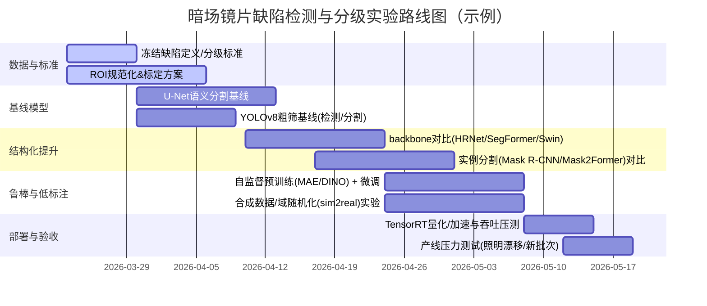

# 暗场光学图像中眼镜片缺陷（划痕/凹坑/大面积裂纹）检测与分级的 AI 系统设计深度研究

## 执行摘要

本报告面向“暗场（dark-field）光学成像”条件下的眼镜片表面缺陷自动化检测与分级：划痕（scratch）、凹坑/麻点（pit/pitted surface）、以及大面积裂纹/碎裂（fracture/crack）。暗场成像的关键优势在于：大部分入射光在光滑表面发生镜面反射并离开视场，而当光遇到表面缺陷时会产生散射，散射光进入镜头，使缺陷呈现“亮、背景暗”的高对比结构，从而显著提升细微缺陷可见性。citeturn21view0turn22search36turn22search24turn15search14

从算法设计角度，暗场眼镜片缺陷检测常见的难点并不在“有没有亮点”，而在：  
1) 细长划痕的拓扑结构（长、细、可能断裂、交叉、曲折）与真实物理尺寸的映射；2) 凹坑往往接近点状、易与灰尘/噪点混淆，且在公开研究中经常是最难的类别；3) 大面积裂纹/碎裂具有跨尺度结构（从细裂纹到大范围高亮区域），需要同时具备局部纹理与全局连通性建模能力；4) 光学系统、环形低角度光源、曝光、偏振、镜片曲率/镀膜差异会导致分布漂移（domain shift），使“训练集很好、产线一变就失效”。citeturn21view0turn25search0turn15search26

因此，推荐以“两条主线并行”的工程方案：  
- **主线A（监督式检测/分割→可解释测量→分级）**：用实例/语义分割得到像素级缺陷区域，再做结构化后处理（连通域、骨架化、长度/宽度/面积/位置统计）实现可审计的缺陷尺寸估计与等级映射；模型层面优先从 U-Net/HRNet/SegFormer/Swin +（FPN/多尺度）起步，必要时上 Mask R-CNN/Mask2Former 做强实例分割。citeturn1search0turn1search2turn2search0turn9search0turn9search2  
- **主线B（异常检测→冷启动/兜底）**：在缺陷标注不足或缺陷类型不断演化时，引入 PaDiM/PatchCore 等“只用正常样本训练”的异常检测，用于早期上线与未知缺陷告警，但需明确其“可定位、弱分类”的属性；且在更新更难、更贴近工业的基准（如包含暗场/背光、透明物体、照明变化的小缺陷场景）上，异常检测总体仍具有显著挑战，应作为兜底而非唯一解。citeturn4search0turn25search26turn25search0turn25search1  

训练策略上，强烈建议利用大量未标注暗场产线图做自监督预训练（MAE/DINO/DINOv2），再少量标注微调，以降低域差、提升鲁棒性。citeturn3search1turn3search2turn3search3 评估上除 mAP/IoU/F1 外，应增加“分级误差”“生产代价指标（漏检=严重损失）”“分布漂移压力测试”，并引入置信度校准与不确定性输出用于人机协同复检。citeturn7search0turn7search1turn7search2

本报告给出两套可落地的推荐：  
- **推荐基线（最快上线）**：ROI 规范化 → 轻量 YOLOv8（检测或分割）→ 简单几何后处理 → 规则/小模型分级；优势是速度快、工程简单，适合快速跑通与数据闭环；风险是对细长划痕拓扑、复杂裂纹的像素精度不足。citeturn26search3turn19view0turn9search3  
- **高精度方案（更高上限）**：多任务两阶段（粗检候选 + 高分辨率精分割 + 同步类型/等级头）+ 自监督预训练 + 不确定性与校准；优势是精度和可解释度高，能更好覆盖小凹坑与大范围裂纹；代价是标注更重、算力更高、工程更复杂。citeturn3search1turn3search2turn7search0turn9search2  

## 暗场成像与缺陷视觉特征

暗场照明的共同机制是：用遮挡或几何布置“抑制直射/镜面反射光进入成像系统”，仅让由样品散射/衍射后的光进入，因此背景趋于暗、散射体（如缺陷边缘、颗粒、裂纹尖端）趋于亮。显微暗场的典型描述是阻挡中心光束、用斜入射形成空心光锥照明，使只有被样品散射的光被物镜收集。citeturn22search36turn0search7 在光学元件/大口径镜片检测的工程实现中，低角度环形光源使大部分光在光滑玻璃表面全反射并离开，只有缺陷处发生散射并有一部分进入镜头，因此缺陷在图像中表现为亮、无缺陷区域为暗。citeturn21view0turn22search24turn15search14

在你提供的示例暗场图像中（圆形镜片区域、背景暗），可见大量高亮细线/曲线（典型划痕特征）与零散点状亮斑（可能是凹坑或灰尘/颗粒）。这种“亮线 + 亮点”叠加、且缺陷密集的情况，对“检测+分级”提出了强挑战：不仅要检出，还要区分形态并量化严重性。

image_group{"layout":"carousel","aspect_ratio":"16:9","query":["dark field illumination scratch inspection image","dark field microscopy pit defect bright spot","dark-field glass crack inspection image","aspherical lens micro scratch dark field image"],"num_per_query":1}

### 划痕、凹坑、裂纹在暗场图像中的典型外观差异

**划痕（scratches）**在暗场中通常呈现为高亮的细长线状结构，具有高长宽比、连续或分段连续、可弯曲、可交叉，亮度沿长度方向可能起伏（与局部深度/宽度、入射角、散射方向相关）。暗场玻璃检测实践也指出：细微划痕在明场可能几乎不可见，但在暗场会形成“暗背景上的清晰亮线”。citeturn22search24turn21view0  
工程上“划痕”还常关联到光学表面质量的行业规范（如 scratch-dig）。例如 ISO 10110 的示例解释中，会用“允许 1 条长划痕、宽度不超过 1 μm、长度超过 4 mm”等方式表达约束；这些维度信息为“分级”提供了可解释的量纲参考。citeturn10view1turn14search8 同时实践资料强调传统划痕可见度评估存在主观性与一致性问题（检验员、照明、对比标准差异），这恰是引入 AI 做客观量化的动机之一。citeturn10view0

**凹坑/麻点（pits）**在暗场中往往表现为局部点状或小斑块高亮，形态更接近“近圆形/椭圆形亮点”，但会与灰尘、微粒、相机热噪声、镀膜微结构产生混淆。公开的光学微缺陷研究中，凹坑类常被报告为最难检测的类别（AP 最低），并且需要模型具备更强的“微小目标”表征能力与更好的去噪/抑尘能力。citeturn21view0

**大面积裂纹/碎裂（fractures/cracks）**在暗场下的表现取决于裂纹是否贯穿、是否伴随崩边/碎裂区域、以及裂纹面/尖端散射强度：  
- 细裂纹可能像“更粗、更不规则的线状结构”，但与划痕不同之处在于：宽度变化更剧烈、分叉更常见、局部形成块状亮区；  
- 大面积碎裂可能形成跨尺度连通的高亮网络，甚至带有大片高亮“破坏区”。  
针对玻璃断裂/裂纹的机器学习研究指出，玻璃裂纹传播/形态本身复杂，做像素级裂纹分割需要针对拓扑复杂性设计框架与数据策略。citeturn22search0

### 影响外观差异与可分性的关键成像因素

暗场缺陷“亮度=散射强度”的隐含关系，会被以下因素强烈调制：  
- **照明几何与角度**：低角度环形光使缺陷散射更突出；不同角度会改变某些划痕的可见性（方向性散射）。citeturn21view0turn22search24  
- **镜片曲率/镀膜与背景纹理**：曲率导致反射路径变化；镀膜/硬化层微结构可能产生背景散射。citeturn15search26  
- **分辨率与视场拼接**：大口径光学检测常需扫描与拼接；在保证 0.5 μm 灵敏度的暗场检测系统中，通过改造照明与扫描路径实现“大面积覆盖同时不降灵敏度”的思路，意味着算法也需面对“拼接边界、亮度不均、位置不对齐”的现实问题。citeturn16view0  
- **多缺陷共存**：真实生产中同一视场出现多种缺陷很常见；光学微缺陷数据集也强调每张图含多个缺陷、且每图 6–10 个缺陷的情况并不少见，使得检测、分割、计数与分级必须联合考虑。citeturn21view0  

## 模型范式与架构选择

将“检测 + 分级”做成可运营的 AI 系统，关键不是只选一个网络，而是选对**任务分解**：定位（where）、形状（what shape）、类别（what type）、严重度（how bad）、以及不确定性（how sure）。工业缺陷检测综述也强调：缺陷尺度变化、速度与精度权衡、小目标等是核心挑战。citeturn15search26

### 模型家族对比与选型建议

下表从准确率上限、鲁棒性、速度、数据需求与可解释分级能力，给出五类范式的工程对比（“推荐场景”是暗场镜片缺陷的典型落点）。

| 范式 | 代表方法 | 优势 | 主要风险/短板 | 数据与标注需求 | 推荐场景 |
|---|---|---|---|---|---|
| 语义分割（pixel mask） | U-Netciteturn1search0 / HRNetciteturn1search2 / SegFormerciteturn2search0 | 直接得到像素区域，利于计算划痕长度/宽度、裂纹面积等“可解释量化”；对细长结构更友好 | 标注成本高；大图推理慢（常需滑窗/多尺度） | 像素级掩膜（必要）；可附带类别/等级 | 划痕&裂纹“要测量/分级”的主干方案 |
| 实例分割（instance mask） | Mask R-CNNciteturn1search1 / Mask2Formerciteturn9search2 / YOLOv8-segciteturn9search3 | 能把重叠/交叉缺陷分开计数；输出实例级形状，方便每条划痕单独评分 | 计算更重；对极细划痕可能仍需高分辨率输入 | 实例级mask（多边形/位图）；类别 | 多缺陷密集、需要“逐缺陷计数+分级” |
| 目标检测（bbox） | YOLOv8citeturn26search3 / EfficientDet（BiFPN）citeturn2search29 / DINO（DETR系）citeturn2search39 | 推理速度快、部署成熟；标注相对便宜；适合粗筛与在线报警 | bbox 难表达细长划痕/不规则裂纹，分级解释性弱；需要后续精分割 | bbox + 类别；等级可做实例级标签 | 产线高速“先筛后精”的第一阶段 |
| 图像/patch 分类（含弱监督） | ViTciteturn3search0 / 轻量CNN | 标注最省（图像级标签）；适合“是否有缺陷/哪类缺陷”快速判定 | 无法精确定位与量化；容易被背景亮点误导 | 图像级类别/等级 | 早期 PoC、或作为多任务辅助头 |
| 异常检测（one-class / 训练少） | PaDiMciteturn4search0 / PatchCoreciteturn25search26 | 缺陷标注稀缺时可冷启动；可输出异常热力图；适合未知缺陷告警 | 分类能力弱；对照明变化/透明物体等更难场景性能仍可能不足 | 大量正常样本；少量阈值校准数据 | 兜底告警、未知缺陷捕获、早期上线 |
| 多任务网络（检测/分割/等级回归联合） | Mask2Formerciteturn9search2 / 自定义多头 | 共享特征、减少多模型维护；可同时输出mask、类别、等级与不确定性 | 训练更复杂；需要更完整标注；调参成本高 | mask+bbox+等级（可分层缺失） | 追求最高精度与端到端产线系统 |

### 推荐优先尝试的具体架构与变体

暗场镜片缺陷具有“跨尺度 + 细结构 + 低背景”的典型属性，因此架构选择应围绕：高分辨率特征保持、多尺度融合、以及对细长拓扑对象的建模能力。

**分割主干（优先级最高，用于可解释分级）**  
- **U-Net 系列**：作为强基线，编码器-解码器+跳连结构非常适合稀疏、细长、需要保细节的分割任务，是低成本起步点。citeturn1search0  
- **HRNet**：持续保持高分辨率并融合多尺度分支，对“极细划痕、密集凹坑”这类小目标与细结构通常更有利。citeturn1search2  
- **SegFormer（MiT 编码器 + MLP 解码器）**：以高效 Transformer 编码器进行多尺度表征、解码简单，工程上易在速度与精度间调 B0–B5 级别。官方实现也明确基于 MMSegmentation 代码库，利于复现与迁移。citeturn2search0turn24search0  
- **Swin Transformer Backbone + UPerNet/Mask2Former 解码**：Swin 通过移位窗口形成分层表征，并具有对图像尺寸线性复杂度的优势；作为密集预测 backbone 已被广泛验证。citeturn24search23turn9search2turn9search1  

**实例分割（缺陷计数/交叉划痕分离）**  
- **Mask R-CNN + FPN**：FPN 通过自顶向下与横向连接构建多尺度语义特征，适合尺度变化大的缺陷；Mask R-CNN 在此之上输出实例 mask，便于逐缺陷分级。citeturn1search1turn9search0  
- **Mask2Former**：统一架构覆盖语义/实例/全景分割，对复杂形态与多实例更具上限，但计算与训练复杂度更高。citeturn9search2  

**检测器（用于高速粗筛/候选生成）**  
- **YOLOv8（含分割头）**：工程生态成熟且支持检测/分割等多任务；公开文档给出发布时间与任务支持，适合作为产线实时第一阶段模型。citeturn26search3turn9search3 公开镜片缺陷工作也展示了 YOLO 系列在镜片缺陷场景的可行性，并指出标注不完整会显著影响精度评估，说明数据闭环很关键。citeturn19view0  
- **EfficientDet（BiFPN）**：系统性把多尺度融合（BiFPN）作为核心卖点，适合小目标密集且需高效的部署场景；可作为 YOLO 的对照组。citeturn2search29turn2search33  
- **DINO（DETR 系增强）**：对复杂场景和多实例有优势，且为端到端检测器；但对实时性与部署链路要求更高，适合高精度对照实验。citeturn2search39turn2search27  

**异常检测（冷启动/未知缺陷）**  
- **PaDiM**：用预训练 CNN 的 patch embedding，并以多元高斯建模正常分布，同时考虑多层语义相关性以提升定位；并在评估协议上考虑非对齐（non-aligned）场景以更贴近工业。citeturn4search0turn25search2  
- **PatchCore**：以“代表性记忆库 + 最近邻”做异常分割，在工业异常检测上达到很高 AUROC，并有官方开源实现，推理速度也强调具有竞争性。citeturn25search26turn25search7  
- **重要现实提醒**：更贴近工业、包含暗场/背光、透明与照明变化的小缺陷新基准上，SOTA 方法平均 AU-PRO 仍显著低于理想水平，说明“异常检测并非一劳永逸”，更适合作为兜底与补充。citeturn25search0turn25search8  

### 损失函数、多尺度与注意力的建议组合

**类别不均衡与小目标**是暗场缺陷的常态：凹坑最难、且正样本像素/实例远少于背景。针对密集检测中的前景/背景极度不均衡，Focal Loss 通过下调易样本权重、聚焦难样本被广泛采用。citeturn6search0 对 bbox 回归，GIoU 作为可导损失可缓解不重叠时 IoU “梯度平台”问题。citeturn6search1 对分割，Dice loss 常用于强不均衡（前景极少）场景；Lovász-Softmax 可作为 IoU 的可优化替代以提升 mIoU 指标。citeturn6search3turn6search2

多尺度方面，建议至少在一个强基线中引入 FPN 式金字塔融合，因其以较低额外成本构建多尺度语义特征。citeturn9search0 若采用 EfficientDet，则直接利用 BiFPN 思路（加权多尺度融合）。citeturn2search29

注意力方面，光学微缺陷研究表明：多轴/多分支注意力可帮助模型区分凹坑与粉尘干扰点，并在凹坑 AP 上带来显著提升（示例工作在暗场光学微缺陷数据上报告“pit 一直最难、引入多轴注意力后更可区分”）。citeturn21view0 这类证据支持在你的场景中把“抑尘、去伪亮点”的注意力/门控模块作为重点消融方向。

### 后处理与分级：从像素到“可审计等级”

暗场缺陷分级应尽量从“像素/实例 → 物理可解释指标 → 等级映射”走，避免纯黑箱。推荐的后处理项包括：  
- ROI 内缺陷连通域提取、实例分割的 mask 清洗；  
- 划痕骨架化（skeleton）与图结构统计：总长度、最大连通长度、分叉数、曲率分布；  
- 凹坑等效直径/面积、亮度峰值与局部对比度（用于区分尘点/噪点）；  
- 裂纹/碎裂：总面积、最大连通域面积、裂纹网络总长度、裂纹覆盖率、是否触及光学有效口径边界。  
分级映射可参考光学行业对划痕/麻点的表达方式（如 ISO 10110 示例中的“划痕宽度、长度阈值”等），并结合你们的客户规范/内控标准固化阈值或训练一个“等级回归/序分类器”。citeturn10view1turn10view0turn14search8  

## 数据集与标注体系

数据设计决定上限。公开研究在光学暗场微缺陷场景中给出了一个典型量级：通过低角度环形暗场系统采集 923 张原始图，增强到 2,769 张，每张包含 6–10 个缺陷，并按 8:1:1 划分；缺陷类型包含凹坑、线状划痕、特殊划痕与污染物。citeturn21view0 这类“多缺陷/图、增强扩充”的数据结构非常接近眼镜片产线的真实分布，可作为你们的规模参照。

### 标注层级与数据格式建议

建议采用“分层可缺失标注”的体系，使得在标注资源有限时仍能训练并逐步升级：

1) **图像级标签（最低成本）**：是否缺陷、缺陷大类（划痕/凹坑/裂纹/未知）、整体等级（OK/NG 或 0–3）。  
2) **实例级标签（中等成本）**：每个缺陷的类别 + 位置（bbox/多边形）。  
3) **像素级标签（最高价值）**：实例 mask 或语义 mask，用于精确测量与分级。  
4) **严重度标注（强业务相关）**：可采用两种路线：  
   - **规则量化→等级**：由 mask 计算长度/面积/宽度后映射等级（更一致、更可追溯）；  
   - **人工等级→监督学习**：直接让标注员给“等级”，但要配套一致性审计与校准。

关于“划痕/麻点”行业表达的可解释锚点：ISO 10110 的教程示例包含对划痕宽度、长度等约束的定量描述；同时 scratch-dig 的实践资料指出人工可见度对比存在主观差异，强调需要固定几何与照明条件或用仪器化方式减小主观性。citeturn10view1turn10view0

### 标注量与类别配比的工程化建议（可按资源扩展）

由于缺陷像素/实例高度不均衡，建议把“以缺陷实例数为中心”的数据目标写进项目计划，而不是只看图像数。一个可操作的起步目标是：  
- 划痕：≥ 2,000 条实例（覆盖短/长、细/粗、单条/交叉、不同方位与不同背景散射）；  
- 凹坑：≥ 2,000 个实例（必须覆盖“易混淆灰尘点”的负例与边界情况）；  
- 大面积裂纹/碎裂：≥ 500 个实例（但要覆盖“跨尺度大连通域”的多样性）。  

这些数字是工程经验型“最低可起跑量”，更稳妥的做法是以公开同类数据为参照：例如光学微缺陷数据每图 6–10 个缺陷，增强后 2,769 图意味着缺陷实例可能达到万级，这类实例规模更容易把凹坑这种难类学稳。citeturn21view0 另一个现实证据是：镜片缺陷检测论文指出“小缺陷难以完全标注”会导致评估出现大量伪 FP/FN，说明你们需要把“标注完整性与抽检复核”当成质量体系的一部分。citeturn19view0

### 类别不均衡处理与合成数据策略

- **损失与采样**：检测用 Focal Loss；分割用 Dice/IoU surrogate；并对凹坑、裂纹等难类做过采样或类别权重。citeturn6search0turn6search3turn6search2  
- **光照/噪声域随机化**：暗场系统中轻微曝光与对比变化会显著影响缺陷可见性；在公开暗场微缺陷数据里，常见增强包括翻转、加高斯噪声、亮度对比度线性变换，并给出噪声方差、对比度系数、亮度偏置的约束范围，用于“增强但不淹没缺陷”。citeturn21view0  
- **物理一致的缺陷合成**：若真实裂纹/凹坑样本稀缺，可用“程序化缺陷 + 域随机化”生成训练数据。一个高质量证据来自 2026 年开放获取研究：使用 Blender 构建高保真 3D 仿真管线，程序化生成带划痕的晶圆合成图，在不同光照/纹理/几何下生成带标签数据，并训练 YOLO 系列模型后直接在真实图上获得很高定位 F1，从而减少人工标注瓶颈。citeturn20view0 该策略可迁移到镜片：用渲染/数字孪生近似暗场散射外观，配合真实少量校准做 sim2real。citeturn20view0turn22search24  

### 推荐标注工具与工作流

在像素级/实例级标注上，建议使用成熟的开源标注平台以支持版本化、审计与半自动标注：  
- entity["organization","CVAT","computer vision annotation tool"]：开源交互式图像/视频标注工具；并有资料说明其开源与维护迁移到 entity["organization","OpenCV","computer vision org"] 生态。citeturn5search0turn26search2  
- entity["organization","Label Studio","open source data labeling tool"]：支持多类型数据标注与多格式导出，适合快速搭建标注项目与迭代。citeturn5search1turn5search5  

工作流上建议：先用检测器（如 YOLOv8）进行预标注 → 人工修正 → 进入高价值样本做像素级精标注；并定期做“标注一致性抽检 + 失败案例复盘”，把“难例库”固化成每周必训的增量数据。YOLOv8 的多任务支持（含分割）也便于把“预标注模型”快速产品化。citeturn26search3turn9search3

## 训练与评估策略

### 预训练、迁移学习与多任务联合

暗场镜片图像与自然图像差异显著（背景更暗、缺陷更稀疏、亮点更“物理驱动”），直接用通用预训练并不总是最佳。建议采用两阶段表征学习：  
1) **自监督预训练（域内未标注大数据）**：用 MAE 的遮挡重建或 DINO 的自蒸馏，在大量未标注的暗场镜片/工位图上学习表征，再进行下游分割/检测微调。citeturn3search1turn3search2  
2) **更强的通用自监督 backbone**：若算力与许可允许，可直接尝试 DINOv2 的特征作为冻结/半冻结 backbone，以提升跨域鲁棒性；其论文与开源实现强调无需标注即可学到可迁移特征。citeturn3search3turn24search6  

在“检测+分级”上，多任务是自然选择：共享 backbone，分出  
- 缺陷分割头（mask）  
- 缺陷类别头（scratch/pit/fracture/other）  
- 严重度头（回归或序分类）  
并通过任务权重或不确定性加权做联合优化（工程上可先手动调权，再上自动权重）。多任务统一分割架构（如 Mask2Former）提供了强参考。citeturn9search2

### 关键损失函数组合（可作为默认起点）

- **分割**：BCE/CE + Dice（解决前景稀少）+（可选）Lovász-Softmax（对齐 IoU/mIoU）。citeturn6search3turn6search2  
- **检测分类**：Focal Loss（对抗前景/背景与类别不均衡）。citeturn6search0  
- **检测回归**：GIoU/IoU 系损失（改善不重叠时可优化性）。citeturn6search1  
- **严重度回归/序分类**：L1/Huber +（序约束正则），并对“临界等级”（如 1/2、2/3）设置更高权重，以降低边界误判的业务风险（此为工程建议，需结合你们等级标准校准）。

### 课程学习、难例挖掘与交叉验证

- **课程学习（curriculum）**：先训练高对比、明显缺陷，再逐步加入低对比/弱缺陷与密集多缺陷图；公开暗场数据与工业异常基准都强调照明变化、缺陷尺度变化会显著增加难度。citeturn21view0turn25search0turn15search26  
- **难例挖掘（hard example mining）**：把“灰尘点误报凹坑”“细划痕漏检”“裂纹与划痕混淆”等失败模式拉成专门子集，每轮训练强制提高采样概率。凹坑被报告为最难类这一现象，应转化为训练过程的显式策略。citeturn21view0  
- **交叉验证**：必须按“镜片/批次/日期/工位”分组做折叠，避免同一镜片多帧/多裁剪跨 train/test 泄漏导致虚高指标（工业缺陷综述也强调数据与评估对真实泛化的重要性）。citeturn15search26  

### 指标体系与评估协议

你需要同时评估“检测是否可靠”和“分级是否可用”。建议指标分层如下：

| 评估对象 | 指标 | 说明与建议 |
|---|---|---|
| 检测（bbox/mask） | mAP（COCO 风格 AP@[.50:.95]）、AP@0.5、Recall | COCO 是检测/分割评估标准数据集之一；mAP/AP 通常以多 IoU 阈值汇总。citeturn11search0turn5search3turn11search10 |
| 分割（pixel） | mIoU、Dice/F1、边界 F-score（可选） | 对细长划痕建议补充“骨架 IoU/长度误差”，避免 mIoU 被背景淹没。Dice 常用于强不均衡场景。citeturn6search3turn6search2 |
| 分类（缺陷类别） | per-class ROC-AUC、PR-AUC、混淆矩阵 | ROC-AUC 用于阈值不敏感对比；可用标准实现定义。citeturn11search3 |
| 严重度（回归/序分类） | MAE/RMSE、分级准确率、相邻等级容忍准确率 | 业务上常允许“±1级”；可明确在验收标准中写入。 |
| 产线业务KPI | 漏检率（特别是严重缺陷）、误杀率、单片节拍、吞吐 | 需按缺陷严重度分层统计；避免总体准确率掩盖高代价漏检。 |
| 异常检测（兜底） | 图像级 AUROC、像素级 AUROC、AU-PRO | 更贴近工业的新数据集指出现有方法在 AU-PRO 上仍有明显差距，说明需要压力测试。citeturn25search0turn25search1 |

评估协议上，强烈建议至少包含两类“现实压力测试”：  
1) **照明漂移测试**：曝光±、亮度/对比度±、光源老化模拟（暗场对照明极敏感）。citeturn21view0turn25search0  
2) **新缺陷/新工位测试**：在新增工位/新镀膜/新供应商的镜片上评估，不允许用该域数据微调，作为真正上线风险评估。

## 部署与可靠性工程

### 延迟、吞吐与架构形态

部署形态取决于你的产线节拍与成像方式（单相机全片、还是多相机分区、还是扫描拼接）。公开镜片缺陷方案中存在两类典型工程：多相机覆盖大表面（例如护目镜镜片用 5 相机覆盖不同区域）与扫描拼接覆盖大口径光学元件。citeturn15search30turn16view0 另有镜片缺陷检测工作展示在边缘设备（Jetson Nano）上以约 10 FPS 实时推理的可行性，为“边缘侧实时”提供了经验锚点。citeturn19view0

在不掌握你们具体节拍前，建议把目标拆成两级：  
- **在线粗筛**（edge）：毫秒级到百毫秒级/帧，尽量“宁可多报也不漏报”，输出候选框/候选区域与置信度；  
- **在线/近线精审**（edge 或 server）：对候选区域做高分辨率分割与计量分级；可通过异步队列在不阻塞主线的情况下完成。

### 推理加速：量化、编译与模型压缩

若采用 GPU/边缘 GPU，entity["company","NVIDIA","gpu company"] 的 TensorRT 提供面向高性能推理的优化与运行时，并支持多精度（FP16/INT8 等）与动态形状；INT8 量化通常需要代表性数据做校准。citeturn26search4turn7search3turn26search0 量化策略上推荐按阶段推进：  
1) FP16（通常较小风险）→ 2) INT8 后训练量化（校准集）→ 3) 必要时做量化感知训练（QAT）以减小精度损失。citeturn7search15turn26search8  

若采用 CPU/集成加速器路线，可参考 entity["company","Intel","semiconductor company"] 生态中针对异常检测/工业缺陷的部署教程与工具链（例如 anomalib + OpenVINO 的示例）。citeturn26search1turn4search3

### 置信度校准与不确定性：把 AI 变成“可运营系统”

工业质检更关心“我该不该信这次判定”。现代神经网络往往置信度不校准，温度缩放是一种简单有效的后处理校准方法。citeturn7search0 对像素级分割/缺陷等级输出，建议至少提供一种不确定性估计：  
- MC Dropout：通过多次随机 dropout 前向得到不确定性估计（代价是多次推理）。citeturn7search1  
- Deep Ensembles：训练多个独立模型，利用预测分歧表示不确定性（代价是存储与推理成本）。citeturn7search2  
这些机制可以驱动“人机协同复检”：只把高不确定样本送人工，从而控制总体人力。

```mermaid
flowchart LR
A[暗场成像采集\n(相机/光源/曝光控制)] --> B[ROI规范化\n(镜片口径分割/去夹具/亮度校正)]
B --> C[粗筛模型\n(检测/粗分割, 实时)]
C --> D{是否有疑似缺陷?}
D -- 否 --> E[判定: OK\n记录与抽检采样]
D -- 是 --> F[候选裁剪/多尺度滑窗\n高分辨率输入]
F --> G[精检模型\n(实例/语义分割 + 类别 + 等级)]
G --> H[后处理计量\n(长度/面积/连通/位置)]
H --> I[分级与决策\n(OK/NG + 等级 + 置信度)]
I --> J[数据闭环\n(保存失败样本/难例库/再训练)]
```

## 实验路线图与基准方案

### 未明确假设与待定问题（必须先冻结，否则很难验收）

以下信息将显著影响模型选择、数据量、延迟目标与分级可行性，建议在项目启动阶段一并明确并文档化：

- 成像分辨率（像素/μm 标定）、每张图覆盖面积、是否扫描拼接、拼接策略与几何误差上限。citeturn16view0turn21view0  
- 光源形态（低角度环形/多角度/偏振）、曝光与增益策略、亮度漂移范围。citeturn21view0turn22search24turn25search0  
- 缺陷定义与分级规范：是否对齐 scratch-dig/ISO 10110 或内部标准？等级是按长度/宽度/面积/位置，还是按可见度/功能影响？citeturn10view0turn10view1turn14search8  
- 产线吞吐与可接受延迟：单片允许的总推理预算（含预处理/后处理）？是否允许“粗筛先过、精审后追溯”？  
- 可获得标注数据体量与节奏：每周可新增多少像素级 mask？是否有大量正常样本可用于自监督/异常检测？citeturn4search0turn3search1turn3search2  
- 目标硬件：边缘端（如 Jetson 类）还是服务器 GPU？功耗/散热/成本约束？（镜片检测在边缘设备 10 FPS 的经验可作为参考起点）。citeturn19view0  
- 误判代价：把“严重裂纹漏检”与“轻微划痕误杀”赋予不同损失权重，决定阈值与验收。  

### 优先级实验清单与消融设计

以下给出一个“先跑通→再提上限→再做鲁棒与部署”的实验序列（你可以按资源并行）：

**阶段一：数据与可解释基线（优先做，决定成败）**  
- E1：ROI 规范化模块：镜片口径分割、去边缘高亮与夹具，建立像素/物理标定（为分级做准备）。citeturn21view0turn16view0  
- E2：分割基线：U-Net（输入 512/768/1024 patch）+ Dice/BCE，对划痕与凹坑做像素分割，并用后处理输出长度/面积。citeturn1search0turn6search3  
- E3：检测基线：YOLOv8 检测/分割做实时粗筛，验证在你们图像上的速度—精度曲线。citeturn26search3turn9search3  

**阶段二：结构化提升（面向难点：凹坑、小目标、裂纹拓扑）**  
- E4：backbone 对比：HRNet vs SegFormer-B0/B2 vs Swin-T（同一数据、同一增强），重点看凹坑 AP 与细划痕漏检率。citeturn1search2turn2search0turn24search23  
- E5：实例分割：Mask R-CNN/Mask2Former 分离交叉划痕与多缺陷计数，评估“每条缺陷的等级一致性”。citeturn1search1turn9search2turn9search0  
- E6：注意力/去伪亮点：引入多轴注意力或通道-空间门控模块，专门消融“尘点→凹坑误报”的下降幅度。citeturn21view0  

**阶段三：鲁棒性与低标注成本（上线前必做）**  
- E7：自监督预训练：MAE/DINO 在未标注暗场图预训练，再微调分割/检测；对比“无自监督”的跨工位泛化。citeturn3search1turn3search2  
- E8：合成数据/域随机化：程序化生成划痕/裂纹并随机照明，验证 sim2real（可借鉴 Blender 合成数据训练 YOLO 并在真实数据上高 F1 的范式）。citeturn20view0  
- E9：异常检测兜底：PaDiM/PatchCore 在大量正常样本上训练，用于未知缺陷告警，并在“照明变化/透明物体”压力集上评估 AU-PRO。citeturn4search0turn25search26turn25search0  

### 成功标准（建议写成可验收SLA）

在未给定你们业务阈值前，建议采用“分层验收”：  
- **严重缺陷（大裂纹/碎裂）**：漏检率优先最小化（可设定极低上限），宁可误杀；  
- **中度缺陷（明显划痕/较大凹坑）**：要求高召回与较低误报；  
- **轻微缺陷（可接受的微划痕/微点）**：允许更多不确定性→进入人工抽检池。  
同时必须给出**节拍指标**与**资源指标**（显存/内存/功耗），并通过量化与校准把推理变成稳定可复现的产线部件。citeturn26search4turn7search3turn7search0  

### 推荐基线管线与高精度管线

**推荐基线管线（快速上线、成本可控）**  
- 模块：ROI 规范化 → YOLOv8（检测或分割）→ 连通域/形态学后处理 → 规则分级。citeturn26search3turn9search3  
- 适用：缺陷较稀疏、主要目标是“快速 NG 拦截 + 缺陷位置可视化”。  
- 预期权衡：速度强、部署快；但对“极细划痕的长度测量”“复杂裂纹网络”“凹坑与尘点区分”上限有限，需要后续升级。citeturn21view0  

**高精度管线（更高上限、数据与算力更重）**  
- 模块：ROI 规范化 → 粗筛检测器（YOLOv8/EfficientDet）生成候选 → 候选高分辨率裁剪/滑窗 → SegFormer/HRNet/Swin+UPerNet 做精分割 + 类别头 + 等级头 → 结构化计量 → 校准与不确定性 → 决策。citeturn26search3turn2search29turn2search0turn1search2turn9search1turn7search0  
- 训练：先用 MAE/DINO 做域内自监督预训练，再用少量高质量 mask 微调；并用难例库持续增量训练。citeturn3search1turn3search2turn19view0  
- 预期权衡：精度、可解释分级、跨工位鲁棒性显著更好；代价是标注与工程复杂度更高、推理链路更长，需要量化/编译与异步流水线支撑。citeturn26search4turn7search3  

**两套方案对比表**

| 方案 | 核心模型 | 主要输出 | 数据需求 | 速度/部署 | 风险点 |
|---|---|---|---|---|---|
| 基线（快） | YOLOv8 检测/分割citeturn26search3turn9search3 | bbox/粗mask + 规则等级 | bbox 或粗mask即可 | 快、易部署，适合 edge | 对细长拓扑与精确计量不足 |
| 高精度（强） | 粗检检测器 + 精分割（SegFormer/HRNet/Swin）citeturn2search0turn1search2turn24search23 | 精mask + 类别 + 等级 + 置信度 | 需要高质量 mask + 等级体系 | 需更强算力/加速优化 | 标注成本、训练复杂度、漂移治理 |

### 实验时间线（示例：8周，起始于 2026-03-23）

