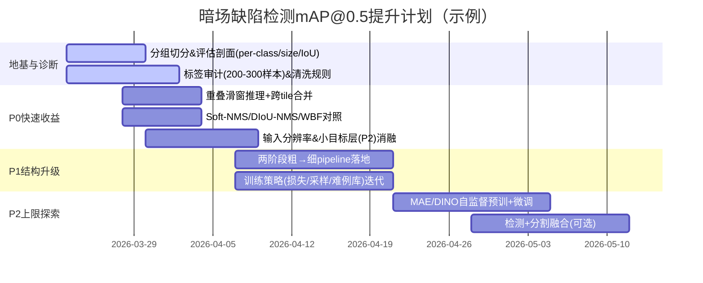

# 暗场眼镜片缺陷检测系统提升方案研究报告

## 执行摘要

你当前的系统形态与指标（247 张高分辨率原图 → 约 10,000 个 patch；传统图像处理生成“粗标注”；改进版 YOLOv12m：mAP@0.5=0.526、mAP@0.5:0.95=0.295、Precision=0.542、Recall=0.505）呈现出一个非常典型的工业缺陷检测问题：**召回与定位精度同时受限，且上限很可能被“标注噪声 + patch 切分策略 + 小目标形态”共同压住**。你要达成 mAP@0.5≥0.60（绝对提升 ≥0.074），最稳妥的路线不是“换一个更大模型”，而是按优先级同时做三件事：

第一，**先把数据/评估的“地基”打牢**：  
- 把验证集切分从“按 patch 随机”改为“按镜片/原图/批次分组切分”，避免同一镜片的相邻 patch 同时出现在 train/val 造成泄漏与虚高或虚低波动（这是工业 patch 体系的常见坑）。  
- 做一次小规模标注审计（例如每类 200–300 个实例），量化粗标注的 IoU 偏差与漏标率，给你一个“mAP@0.75/0.5:0.95 的理论上限”判断（若粗标注本身定位偏差大，mAP@0.5:0.95 低可能是“标签上限”而非模型上限）。COCO 指标体系中 mAP@0.5:0.95本质上对定位更苛刻，因此能很好暴露“定位噪声/边界不准”的问题。citeturn8search0turn3search1  

第二，**用“粗→细”的两阶段与“多尺度/滑窗重叠”解决暗场小缺陷与边界截断**：  
- 第一阶段用轻量检测器在更低分辨率或更大 stride 上做**候选区域生成**（高召回优先）；第二阶段对候选区域做**高分辨率精检**（提高 IoU 与减少漏检）。两阶段能把算力花在“疑似缺陷”上，是高分辨率检测的工程常用解。  
- 在推理上用**滑窗 + 重叠 overlap**取代“无重叠拼 patch”，缓解缺陷被切到 patch 边缘导致框被截断、NMS 冲突、以及训练/推理分布不一致的问题。重叠滑窗是处理大图（检测/分割）最常见的策略之一。citeturn9search11  

第三，**把度量提升点集中在“噪声标签稳健训练 + 小目标/细长目标改造 + 后处理”**：  
- 训练端：对强类别不均衡与稀疏前景采用 **Focal Loss**（分类）与 IoU 系回归损失（GIoU/DIoU/CIoU），并配合难例挖掘（OHEM 思想）与渐进式 curriculum。citeturn3search0turn3search1turn3search2turn9search1  
- 推理端：将 NMS 替换为 **Soft-NMS**（或至少做对照实验）、加入 TTA（多尺度/翻转）并用 WBF 融合多次预测，可在不改模型的情况下获得“立竿见影但有限”的 mAP 增益。citeturn0search0turn0search1  

在“只做缺陷识别（检测）”且数据量有限（247 原图）这一约束下，最务实的成功路径是：  
- **P0 快速收益（1–2 周）**：切分与评估修正 + 重叠滑窗推理 + Soft-NMS/WBF + 小目标层（P2）/输入分辨率 ablation + 标签清洗小预算；常见可贡献 **+0.03 ~ +0.08 mAP@0.5**（区间取决于你当前切分是否泄漏、边界截断有多严重、粗标注噪声水平）。  
- **P1 中期（3–6 周）**：两阶段 pipeline（粗检→精检）+ 半自动精标注/主动学习 + 自监督预训练（在所有未标注 patch 上做 MAE/DINO 预训后微调），目标再拿 **+0.03 ~ +0.07**。citeturn5search1turn5search0  

下文给出：失效模式诊断、可直接照做的模型/训练/数据改造步骤、三张关键表（模型对比、数据与标注计划、实验矩阵），以及 4–8 周时间线与系统管线图。

## 指标与数据条件下的失效模式诊断

### 从指标形态推断的主要瓶颈

你当前的 **mAP@0.5=0.526 vs mAP@0.5:0.95=0.295** 差距较大，通常意味着以下至少一项成立（多项叠加最常见）：

1) **定位不够准（高 IoU 阈值下掉分）**：  
- 小缺陷（细划痕/小凹坑）在框尺度很小时，哪怕像素级误差不大，也会导致 IoU 大幅波动，从而显著拉低 mAP@0.75 及更高阈值的 AP，最终拖累 mAP@0.5:0.95。citeturn8search0turn3search1  

2) **标签噪声导致“训练目标与评估目标不一致”**：  
- 你使用“传统图像处理产生粗标注”，这通常伴随：框偏移、框过大/过小、漏标（FN label）和误标（FP label）。在噪声标签上训练会显著限制检测上限，并可能同时伤害 Precision 与 Recall。噪声标签学习一直被认为是深度学习落地的核心难题之一。citeturn5search19  

3) **召回不足（Recall=0.505）与阈值/后处理相关**：  
- 你的 Recall 与 Precision 都在 0.5 左右，说明系统既漏检不少，也误报不少。低召回可能来自：切 patch 截断、NMS 过严、置信度阈值偏高、小目标特征不足、类别不均衡导致模型偏向背景。Focal Loss 被提出就是为了解决密集检测里前景/背景极端不均衡导致的训练失衡。citeturn3search0  

4) **patch 切分与采样带来的结构性误差（非常高概率）**：  
- 247 原图变成 10,000 patch，意味着大量 patch 彼此相邻且高度相关。常见问题包括：  
  - **边界截断**：缺陷被切到 patch 边缘，标注框被截断成“残缺框”，训练时学到错误形态；推理时跨 patch 同一缺陷可能被检测成多个碎片框。  
  - **上下文丢失**：缺陷与其周围散射背景的对比关系被破坏，尤其对细长划痕或大裂纹网络更明显。  
  - **切分泄漏**：如果 train/val 按 patch 随机划分，同一镜片的相邻 patch 同时出现在 train/val，会造成评估偏差（有时虚高，有时因为相似难例集中而虚低）。  

5) **IoU 与标注体系不匹配（细长划痕尤其明显）**：  
- 若缺陷是细长曲线，使用轴对齐 bbox 本身就比较“粗”，同一条划痕不同标注员/不同阈值会给出差异很大的框；粗标注更会放大这种差异，导致高 IoU 阈值 AP 注定低。此时要么接受“只看 mAP@0.5”，要么引入 mask/骨架得到更稳定的几何描述，再回投到 bbox（见后文“检测+分割融合”）。citeturn2search1turn2search3  

### 建议你立刻做的“快速诊断清单”（一天内可完成）

这些检查能在不改模型的情况下告诉你：提升空间主要在数据还是模型。

- **按缺陷尺寸统计 AP**：按 COCO-style small/medium/large（或自定义像素面积分桶）计算 AP@0.5，判断是否“主要死在 small”。COCO 的评估体系就是为此类分析而设计。citeturn8search0  
- **看 IoU 分布**：对 val 中 TP 的预测框与 GT 框 IoU 分布画直方图；若大量 TP IoU 集中在 0.5–0.65，说明模型能“找得到”但定位差，通常与分辨率/小目标层/标签噪声相关。citeturn3search1  
- **抽样 200 张 patch 做标签审计**：统计（a）明显漏标率（b）框偏移/过大过小（c）“图像处理误检当 GT”。这会直接决定你是否该优先投入“标签清洗”。citeturn5search19  
- **边界截断比率**：统计 GT 框是否贴近 patch 边缘（比如离边缘 < 10 px）；比例若高，优先做重叠滑窗与训练时边界策略。citeturn9search11  

## 架构与推理管线的可落地改造方案

本节给出三类架构升级路径：  
- “不推翻现有 YOLOv12m 的增量改造”（最快）  
- “两阶段粗→细”（最适合高分辨率缺陷、提升 mAP@0.5 的性价比高）  
- “检测 + 分割融合/多任务”（对细长划痕、边界噪声更稳，但标注成本更高）

### YOLO 系列的增量改造与对照组

你已有 YOLOv12m（细节未知，视作“YOLO 系一阶段检测器”）。建议你把改造拆成可控 ablation（每次只改一处），优先做以下四组：

**小目标/细长目标增强（优先级最高）**  
- 增加更高分辨率特征层（常见做法是增加 stride=4 的 P2 检测头，或确保 neck 能把浅层高分辨率特征有效融合）。多尺度特征融合在检测小目标上已经被 FPN 类工作系统证明有效。citeturn2search2  
- 用更强的特征融合 neck：FPN/PAFPN（YOLO 常见）或对照 BiFPN（EfficientDet 的核心贡献之一）。citeturn2search2turn0search3  

**anchor-based vs anchor-free 的现实权衡**  
- YOLOX 明确将 YOLO 改为 anchor-free，并结合 decoupled head 与 SimOTA label assignment 获得强性能与工程可部署性；如果你的 YOLOv12m 仍是 anchor-based，可做对照：  
  - anchor-based：可能需要重新聚类 anchor 以覆盖“超高长宽比划痕框”；  
  - anchor-free：通常更省调参，对尺度与形态泛化更稳，但对极端细长框是否更好需要你的数据验证。citeturn0search2turn0search14  
- YOLOv8 文档也强调其采用 anchor-free split head，并作为速度-精度折中方案广泛应用；因此 YOLOv8/YOLOX 可作为强对照基线。citeturn8search3turn4search3  

**注意力模块（小改动、可快速验证）**  
如果误报来自“散射亮点/灰尘点/纹理”，轻量注意力模块常能提升特征选择性：  
- SE（通道注意力）与 CBAM（通道+空间注意力）都是可插拔模块，额外成本较低，适合作为 quick ablation。citeturn6search0turn6search1  
- ECA 是更轻量的通道注意力替代，可在算力很紧时尝试。citeturn6search2  

**后处理与推理策略（几乎“零训练成本”）**  
- Soft-NMS：将硬抑制变成对重叠框的连续衰减，常在拥挤/碎片化目标上带来稳定收益。citeturn0search0turn0search4  
- DIoU-NMS：DIoU 工作中也讨论把 DIoU 作为 NMS 判据来提升表现，可作为对照。citeturn3search2  
- WBF：对 TTA（多尺度/翻转）或多模型 ensemble 的框做加权融合，适合“跨 tile 重叠导致重复框”的场景。citeturn0search1turn0search5  

### 两阶段粗→细：对高分辨率暗场缺陷最务实的“提 mAP@0.5”方案

当原图高分辨率、缺陷小且密、patch 边界截断明显时，两阶段通常比“单模型硬堆分辨率”更稳定：

- **第一阶段（粗检）**：在较低分辨率/较大步长上跑 YOLOv12m（或更轻的 YOLOv8s/YOLOX-s），目标是高召回地给出候选框（允许多一些 FP）。  
- **候选生成策略**：把粗检框做适当膨胀（context padding），并合并相邻框，生成若干候选 ROI。  
- **第二阶段（精检）**：对每个 ROI 以更高分辨率（或更小 stride、更强 backbone）进行精检，提高 IoU 与减少漏检。  
- **推理上用重叠滑窗**：对整张镜片图做 overlap tiling，确保缺陷不会因为贴边被截断；滑窗与 overlap 是大图推理常用策略。citeturn9search11  

这种粗→细在工程上特别适合你：你已经有 patch 数据与 YOLO 体系，只需要把“patch 切分”从离线固化变成**推理时的可控滑窗**，再把精检模型专注于“疑似区域”。

### 检测 + 分割融合：用 mask 稳住细长划痕与粗标注偏差

如果你发现以下现象：  
- mAP@0.5 提升不难，但一旦优化定位（mAP@0.5:0.95）就卡死；  
- 细长划痕标注框很不稳定，模型“看到缺陷但框对不齐”；  
那么建议引入分割作为辅助任务或替代表示：

- **选型 A：实例分割（Mask R-CNN / Mask2Former）**  
  - Mask R-CNN 在检测框上增加 mask 分支，能输出每个实例的像素区域，利于把“细线状缺陷”表达得更稳定。citeturn2search3turn2search7  
  - Mask2Former 是通用分割架构，可同时做语义/实例/全景，对复杂形态有更高上限，但训练与推理成本更高。citeturn2search0turn2search4  

- **选型 B：语义分割（U-Net / HRNet / SegFormer） + bbox 投影**  
  - U-Net 结构简单、对小数据较友好，且强调通过强数据增强提高数据效率。citeturn2search1  
  - HRNet 维护高分辨率表征，对细结构与小目标往往更有利。citeturn1search3  
  - SegFormer 用层级 Transformer 编码器输出多尺度特征，且不依赖固定位置编码，适合训练/测试分辨率不一致的场景。citeturn1search2turn1search6  

- **融合方式（建议从低成本开始）**  
  - 先训练一个分割网络输出缺陷热图（哪怕是粗 mask），再从 mask 提取连通域/外接框作为检测输出（或作为“候选生成”输入给检测器）；  
  - 或在 YOLO backbone 上挂一个轻量 segmentation head，做多任务训练，让分割作为辅助监督稳定特征学习（对噪声 bbox 特别有帮助）。

> 注：你当前目标是 mAP@0.5≥0.60（检测），不要求分割指标；因此分割的价值在于“提高可检测性/稳定几何”，最终仍投影回 bbox 进行评估。

### 模型路线对比表（预期精度/延迟/数据需求）

下面给出在工业缺陷“高分辨率 + 小目标 + 稀疏前景”条件下的经验型对比（**增益是相对你当前 0.526 的合理区间估计**，实际取决于标签噪声与切图策略；延迟以单 GPU/边缘 GPU 粗略相对量级表达，便于决策）。

| 路线 | 推荐模型/实现 | 预期 mAP@0.5 增益（估计） | 延迟/吞吐影响 | 数据与标注需求 | 适用前提 |
|---|---|---:|---|---|---|
| YOLO 增量改造 | YOLOv12m ablation；对照 YOLOv8（anchor-free）citeturn8search3turn4search3 / YOLOX（anchor-free）citeturn0search2turn6search3 | +0.02 ~ +0.06 | 低到中 | 维持 bbox，但需要清洗 | 你希望最快达标，且标注噪声可控 |
| 两阶段粗→细 | 粗检 YOLO + 精检（高分辨率 YOLO/DETR类） | +0.03 ~ +0.08 | 中到高（但可异步/只处理候选） | bbox 为主；可逐步加精标 | 原图很大、边界截断严重、小缺陷密 |
| 引入 BiFPN | EfficientDet（BiFPN）citeturn0search3 | +0.01 ~ +0.04 | 中 | bbox；对小目标有帮助 | 你能接受替换框架/训练脚本 |
| Transformer 检测 | DETRciteturn1search0 / DINO（DETR 系强基线）citeturn1search1turn1search13 | +0.02 ~ +0.06 | 中到高 | bbox；训练更复杂 | 你有较强算力/工程能力，追求稳定位姿与全局建模 |
| 检测+分割 | Mask R-CNNciteturn2search3 / Mask2Formerciteturn2search0 | +0.03 ~ +0.10（若细长划痕是主痛点） | 高 | 需要 mask 或可生成伪 mask | 划痕/裂纹几何复杂，bbox 不稳定 |

## 数据与标注改进路线：把“粗标注”变成可用监督

你最大的优势是：**已经有大量 patch 与自动粗标注**。你的最大风险也是：**粗标注噪声可能把上限锁死**。因此数据策略建议以“清洗 + 半自动精修 + 主动学习”三段式推进，而不是一上来全量重标。

### 标签清洗的可执行步骤（强烈建议优先做）

1) **建立“金标准小集合”**：每类缺陷（或至少缺陷/无缺陷）各抽 100–300 个实例，由人工精修 bbox（最好在原图坐标系上修，避免 patch 截断的误导）。  
2) **量化粗标注质量**：  
   - 漏标率：人工发现但粗标注不存在的缺陷占比；  
   - IoU 偏差：粗标注框与人工框 IoU 分布；  
   - 误标率：粗标注中的“非缺陷”比例。  
3) **制定规则化清洗**（先规则后模型）：  
   - 过滤明显不合理框：极小/极大面积、离散亮点连成超大框、长宽比异常等；  
   - 合并/拆分策略：相邻框合并阈值、碎片框处理；  
4) **引入“自训练/伪标签修正”**：用当前 YOLOv12m 在全量 patch 上推理，取高置信预测与粗标注做一致性对齐：  
   - 对于“模型高置信但无粗标注”的区域，进入人工复核队列（可能是粗标注漏标）；  
   - 对于“粗标注存在但模型始终低置信”的区域，优先人工检查（可能是粗标注误标）。  
自训练/伪标签在半监督/弱监督检测中被反复讨论为能逐步改善标注质量与模型性能的手段。citeturn5search7turn5search3  

### 半自动 mask 精修：降低后续成本（即使你最终只评估 bbox）

如果你决定走“检测+分割”或“分割辅助”的路线，需要更细的像素级信息。建议做低成本的半自动化：

- 用分割模型（U-Net/SegFormer）在粗标注框内生成缺陷热图，再由标注员在 CVAT/Label Studio 中做少量交互修正。U-Net 强调在小样本下通过数据增强获得有效训练。citeturn2search1  
- CVAT 与 Label Studio 都支持多边形/掩膜等标注形态，并支持模型辅助标注（工程上利于闭环）。citeturn7search0turn7search1  

### 主动学习与难负样本挖掘（Hard negatives）

暗场缺陷里“亮点噪声/灰尘/反光纹理”通常是误报主因。建议明确建立 **Hard-negative 库**：

- 每轮训练后，收集 FP 最高的 patch（按置信度排序），人工快速确认“非缺陷”，加入 hard-negative 集；  
- 同时收集 FN（漏检）样本，尤其是贴边、弱对比、小目标样本。  
在检测训练中，OHEM 的思想是让模型更多地关注高损失难例，对提升性能很常见。citeturn9search1turn9search5  

主动学习方面，你可以用“最高不确定性/最具代表性”的样本优先标注以减少总标注量；这类方法在深度主动学习综述中被系统讨论。citeturn9search0turn9search4  

### 数据/标注计划表（预算化、可执行）

| 阶段 | 目标 | 标注类型 | 最小目标量（建议） | 预计人工工时（粗估） | 预期收益 |
|---|---|---|---:|---:|---|
| 快速金标准 | 估计标签上限、确定主要错误类型 | 精修 bbox | 每类 100–300 实例（或缺陷/无缺陷各 500 patch） | 4–12 小时 | 评估可信度大幅提升；指导后续投入 |
| 清洗与复核 | 修复粗标注漏标/误标与截断框 | bbox 复核 | 每轮 500–1500 patch（优先 FP/FN） | 8–30 小时/轮 | 常见是 mAP@0.5 提升的最大来源之一 |
| 分割辅助（可选） | 稳住细长划痕几何，减少 IoU 波动 | mask（框内局部即可） | 100–300 张关键难例 patch（或 20–50 张原图 ROI） | 10–25 小时 | 若细长划痕是主痛点，收益高 |

> 工时为“单人熟练标注员”的粗略范围；你可以通过 CVAT/Label Studio 的模型辅助与批量操作显著降低成本。citeturn7search0turn7search1  

### 合成与增强：让模型见到“更广的暗场变化”

你 patch 数量看似多，但来源只有 247 原图，域内多样性可能不足。建议把增强分成三层：

- **光学/摄影变化增强（必须）**：亮度/对比度、噪声、轻微模糊、局部增益漂移，以模拟暗场照明漂移与相机噪声。  
- **MixUp/CutMix（对抗噪声标签、提升泛化）**：MixUp 论文明确指出其能减少对噪声标签的记忆并提升泛化；CutMix 也常带来检测迁移收益。citeturn4search0turn4search1  
- **Copy-Paste（对稀缺类别与小目标很有效）**：Copy-Paste 在实例分割/检测中被证明能有效提升性能，尤其对稀有类别有益；你可以把“真实缺陷 cutout”贴到“正常暗场背景”上构造更多正样本。citeturn4search2turn4search6  

## 训练与损失策略：针对小目标、噪声标签与不均衡

### 损失函数与权重策略（建议作为默认起点）

- **分类损失**：Focal Loss 作为处理前景/背景不均衡的标准工具，建议作为检测分类项的基线选择或至少对照。citeturn3search0  
- **回归损失**：  
  - GIoU 能改善 IoU 在不重叠时不可优化的弱点；  
  - DIoU/CIoU 将中心距离与长宽比纳入回归，有助于更快收敛与更好定位，且可扩展到 NMS 判据。citeturn3search1turn3search2  
- **分割辅助（可选）**：若你引入分割头，提高小目标可分性，可用 Lovász-Softmax 作为 IoU surrogate，帮助优化 mIoU/IoU 相关目标。citeturn3search3turn3search7  

### 采样与课程学习：把训练重点放在“难小缺陷”

- **Balanced sampler / 过采样稀缺类**：让每个 batch 中包含更高比例的稀缺缺陷（例如凹坑/微裂纹），避免模型被大量“无缺陷背景”主导。针对检测不均衡问题的研究与工程实践都强调采样策略的重要性。citeturn9search6turn3search0  
- **课程学习（Curriculum）**：先用“明显缺陷/完整缺陷/不贴边”训练稳定表征，再逐步加入贴边、弱对比、小缺陷困难样本。  
- **难例挖掘（Hard example mining）**：每轮训练后把 FP/FN 的 top-K 样本加入下一轮重点采样；OHEM 是经典参考。citeturn9search1turn9search5  

### 自监督预训练：利用你的“海量未标注 patch”低成本提上限

你有 10,000 patch（且实际可生成更多），即使标注噪声大，也非常适合自监督预训练：

- **MAE**：通过高比例遮挡重建学习视觉表征，论文证明其在下游任务迁移上表现强，并且训练效率高。建议在所有未标注 patch（含正常/缺陷）上做 MAE 预训练，再微调检测/分割。citeturn5search1turn5search5  
- **DINO（自监督 ViT 表征）**：自蒸馏式自监督在 ViT 上展现出包含分割相关结构信息的“涌现属性”，对你这种“缺陷形态结构化、背景简单”的场景很有潜力。citeturn5search0turn5search4  
- **DINOv2**：作为更强的通用自监督特征学习路线，可用于特征提取/初始化，但工程复杂度更高；更适合你在 P1/P2 阶段做对照。citeturn5search2turn5search6  

实操建议（非常具体）：  
1) 先在 patch 上做 MAE 预训（ViT-B 或轻量 ViT），输出 backbone；  
2) 用该 backbone 初始化检测器（或作为分割/检测共享 backbone），仅微调后几层与 head；  
3) 与“ImageNet 监督预训”做对照，观察 val 的 per-class AP 与小目标 AP。  

### 训练超参建议（在信息未知条件下的默认可行设置）

由于你未给出 patch 尺寸、每 patch 缺陷密度、类别数、训练硬件等，这里给出在 YOLO 系/一般检测框架上通常有效的一套“默认起跑线”：

- 输入分辨率：至少做 3 档 ablation（例如 640 / 960 / 1280），观察 small AP 与 Recall 变化；  
- 训练策略：先冻结 backbone 10–20 epoch（如果使用预训练），再全量微调；  
- 学习率：采用 cosine/one-cycle（如果你的框架支持），并保持较小 warmup；  
- 增强策略：  
  - 轻 photometric（亮度对比度/噪声）始终开启；  
  - MixUp/CutMix 的强度从小到大做网格；  
  - Copy-Paste 仅对稀缺类开启；  
- 交叉验证：至少做 “按镜片分组”的 3-fold 或 5-fold，以抵抗 247 原图带来的高方差。  

## 评估与验证协议：把 mAP 提升做成“可信结果”

### 必须输出的评估剖面

为了知道“提升来自哪里、是否真的达标”，建议每次实验固定输出：

- **per-class AP@0.5**：看是哪一类拖后腿；  
- **size-based AP**：至少按 small/medium/large 分桶（或按像素面积四分位），确认你是否主要被 small 压制。citeturn8search0  
- **PR 曲线**：不要只看一个（Precision、Recall）点；mAP 是对阈值扫描的汇总，但你的线上阈值仍需根据 PR 曲线选取。  
- **IoU 阈值剖面**：AP@0.5、AP@0.6、AP@0.7… 画曲线，能直观看出是“找不到”还是“框不准”。citeturn3search1  

### 避免泄漏的切分协议（强烈建议作为验收标准）

你当前从 247 原图切成 10,000 patch，最常见的泄漏是“同一镜片/同一原图的不同 patch 混入 train 与 val”。建议你把 split 规则写死：

- **Group split by lens/original-image**：同一原图（或同一镜片ID/同一批次）只能属于一个集合（train 或 val 或 test）。  
- 如果你还有“拍摄批次/光照设置/设备号”，尽量让 val/test 覆盖不同批次（更接近上线）。  

这一步往往会让指标先下降，但能避免你对 mAP≥0.60 产生“错误自信”，也能把下一步投入导向真正有效的方向。

### 置信度校准与不确定性阈值（用于选阈与主动学习）

即使你的目标是 mAP@0.5，实际线上也离不开阈值。现代网络常置信度不校准，温度缩放是简单有效的后处理校准方法，可用在“挑选主动学习样本/难例复核队列”。citeturn8search1turn8search5  

## 优先实验计划、消融矩阵与资源估算

### 系统管线建议图（粗→细→重叠滑窗→后处理→输出）

```mermaid
flowchart LR
A[原图/镜片ROI] --> B[重叠滑窗切片\n(overlap tiling)]
B --> C[粗检检测器\n(YOLO系, 高召回)]
C --> D{候选ROI合并/扩张\n(context padding)}
D --> E[精检检测器\n(高分辨率/更强backbone)]
E --> F[后处理\nSoft-NMS/DIoU-NMS/WBF]
F --> G[输出检测结果\nbbox + 分数 + 类别]
E --> H[可选: 分割辅助\n(U-Net/SegFormer/Mask2Former)]
H --> F
```

### 实验矩阵（带优先级、预期增益、成本）

下表把你要达成 mAP@0.5≥0.60 的路径拆为可执行实验；“增益”为经验区间估计（相对当前 0.526），用于排序，而非承诺。

| 优先级 | 实验 | 具体做法（一步到位可执行） | 预期增益（mAP@0.5） | GPU 成本（粗估） | 标注成本 |
|---|---|---|---:|---:|---:|
| P0 | 切分与评估修正 | 改为 by-lens/原图分组 split；输出 per-class/size AP | 不一定升，**但让结果可信** | 低 | 0 |
| P0 | 重叠滑窗推理 | overlap=20–30% 做对照；合并跨 tile 重复框 | +0.02 ~ +0.05 | 低–中（推理变慢） | 0 |
| P0 | Soft-NMS / DIoU-NMS | 替换 NMS 做对照；调 overlap 阈值 | +0.01 ~ +0.03 | 0 | 0 |
| P0 | 分辨率 + 小目标层 | 输入 640/960/1280；增加 P2 head/强化浅层融合 | +0.02 ~ +0.06 | 中 | 0 |
| P0 | 标签清洗小预算 | 抽样审计→规则清洗→复核 FP/FN top-K | +0.03 ~ +0.10 | 低 | 8–30h |
| P1 | 两阶段粗→细 | 粗检高召回，精检高分辨率；仅对 ROI 精检 | +0.03 ~ +0.08 | 中–高 | 0–少量 |
| P1 | 训练损失与采样 | Focal + DIoU/CIoU；balanced sampler；hard-negative | +0.01 ~ +0.04 | 中 | 0–少量 |
| P1 | TTA + WBF | 多尺度/翻转推理；WBF 融合 | +0.01 ~ +0.04 | 中（推理多次） | 0 |
| P2 | 自监督预训 | MAE/DINO 在所有 patch 预训再微调 | +0.02 ~ +0.06 | 高 | 0 |
| P2 | 检测+分割融合 | 分割辅助头或实例分割（Mask R-CNN/Mask2Former） | +0.03 ~ +0.10 | 高 | 10–25h（mask） |

关键依据：Soft-NMS 提供低成本改进路径；WBF 用于融合多次预测；Focal/IoU 系损失是解决不均衡与定位优化的标准工具；滑窗重叠是大图推理的常用工程策略。citeturn0search0turn0search1turn3search0turn3search2turn9search11  

### 4–8 周时间线（建议版）



### “快速收益” vs “长期投资”总结

**快速收益（低投入高回报，优先做）**  
- 重叠滑窗推理 + 跨 tile 合并（直接打掉边界截断与重复框问题）。citeturn9search11  
- Soft-NMS / WBF（几乎零训练成本，常有稳定小增益）。citeturn0search0turn0search1  
- 标签清洗小预算（往往是最大增益来源，尤其你是粗标注）。citeturn5search19  
- 输入分辨率与 P2 小目标层消融（在暗场小缺陷上通常是关键）。citeturn2search2  

**长期投资（提高上限与跨工况鲁棒性）**  
- MAE/DINO 自监督预训练（充分利用未标注 patch，以较低人工成本提升泛化）。citeturn5search1turn5search0  
- 检测+分割融合（当细长划痕 bbox 不可稳定时，这是最“物理一致”的建模方式之一）。citeturn2search3turn2search0  
- 主动学习体系化闭环（持续降低边际标注成本，适合产线迭代）。citeturn9search0turn9search4  

### 未明确的关键假设清单（按你要求全部视为未知）

以下信息若不明确，会显著影响“最优工程方案”和收益上限；本报告在未获信息时**不做假设**，仅给出可兼容的通用策略：

- 原图分辨率、镜片 ROI 尺寸、像素到物理尺寸标定是否存在  
- patch 尺寸（例如 512/640/1024）、是否缩放、缩放插值方式  
- patch 生成是否有 overlap、边界处 GT 如何裁剪/丢弃  
- 缺陷类别体系（仅缺陷/无缺陷？还是多类缺陷？类间是否极不均衡？）  
- 标注格式（COCO/VOC/YOLO）、粗标注来源（阈值分割？边缘检测？形态学？）与典型误差模式  
- 当前验证集切分策略（是否按原图/镜片分组）、是否存在数据泄漏  
- 训练/推理硬件（GPU 型号/显存）、可接受推理延迟（是否允许两阶段与 TTA）  
- 线上是否需要“整片镜片输出”还是“patch 输出”；是否需要跨 tile 合并为全局坐标  
- 目标 mAP@0.5≥0.60 的验收数据集与评估脚本是否固定、是否与 COCO AP 定义一致citeturn8search0  

---

如果你把上述 P0/P1 路线按顺序执行（尤其是：**按镜片分组切分 + overlap tiling + 小预算标签清洗 + 小目标层/分辨率消融 + Soft-NMS/WBF**），在多数暗场小缺陷检测项目中，达到 **mAP@0.5≥0.60** 是很现实的目标；而如果你希望在总体 mAP@0.5:0.95 也显著提升，则基本不可避免要投入“更干净的定位标注（或引入 mask）”与更强的高分辨率建模。citeturn8search0turn2search1turn0search0
---

# 附录：Phase 3B 实验执行总结（2026-03-22 ~ 2026-03-24）

> 本节记录上述策略在本项目中的实际执行结果。**以下是接手人员最需要了解的当前状态。**

## 当前系统状态（截至 2026-03-24）

**生产权重**：`output/training/stage2_cleaned/weights/best.pt`（YOLOv12m，39MB）
**CNAS 基线结果**（conf=0.001, iou=0.6, 860 tiles）：

| 指标 | 数值 |
|------|------|
| mAP@0.5 | **0.6765**（CNAS 通过标准 ≥60%） |
| scratch AP | 0.4525 |
| spot AP | 0.8180 |
| critical AP | 0.7589 |

## 已执行的算法改进路线及结果

依照本报告建议方向，实际执行了三条改进轨道，均未能改善 scratch AP。

### Track A：公开数据预训练（SSGD）

执行路径：COCO 预训 → SSGD 预训 → 私有微调 → CNAS 评估

| 变体 | CNAS mAP | scratch AP | Δ |
|------|---------|-----------|---|
| A0 基线 | 0.6765 | 0.4525 | baseline |
| C1 全参微调 | 0.6755 | 0.4409 | −0.0116 |
| C1_freeze10 | 0.000 | 0.000 | 崩溃 |

根因：SSGD 是彩色自然光图像，与暗场灰度图域差过大，迁移无效。冻结变体权重文件大小异常（~40MB vs 正常 121MB），推测 early stop 在极早期触发。

### Track B：GSDNet 方向特征 + NWD 损失

实现了 SFEBlock（方向约束可变形卷积）和 HybridBboxLoss（α·NWD + (1-α)·CIoU）。

**重要注意**：NWD 在 AMP 环境下必须 `torch.amp.autocast(device_type="cuda", enabled=False)` 包裹整个 forward，且 lr0 需降至 ≤0.001，否则 epoch 15-25 会出现 NaN 崩溃。详见 `doc/研究实验日志_20260322_Phase3B_算法改进开发方案与实现.md`。

| 实验 | CNAS mAP | scratch AP | 说明 |
|------|---------|-----------|------|
| A0 基线 | 0.6765 | **0.4525** | 当前最优（scratch） |
| B2 NWD only (lr=0.001) | **0.6802** | 0.4488 | 当前最优（mAP） |
| B1 SFE only | 0.6262 | 0.4062 | LODConv 初始化导致收敛不足 |
| B3 SFE+NWD | 0.5856 | 0.3811 | 两模块叠加退化 |

实现文件：`src/darkfield_defects/ml/sfe_modules.py`，`src/darkfield_defects/ml/nwd_loss.py`

### Track C：像素级分割

已完成全流程（MSD 预训练 → 私有弱标签生成 → 私有微调），推理流水线支持 `--use-segmentation`。分割能力已可用于 WearScore 精确面积/长度计算，但未直接改善检测 AP。

## 根本障碍：为什么算法改进无效

FN 分析（`scripts/analyze_scratch_fn.py`）揭示了根因：

```
漏检率：51.77%（基线 conf=0.20 下只有 48.23% 划痕被检到）
FN 中位面积：1430 px²（不是 tiny object 问题）
最难图像 37r-ljj：96.8% miss，像素 std=2.4（正常图像约 8.9）
结论：低对比度域偏移，不是 bbox 几何问题
```

SFE 和 NWD 针对"能看到但框不准"的场景，无法解决"图像物理上缺乏可辨别特征"的根因。

## 最高优先级的下一步

**CLAHE/对比度增强预处理**是目前最有潜力的方向，直接攻击低对比度根因，无需重标注。

- 目标图像列表：`output/experiments/phase3b_fn_analysis/hard_negatives.txt`
- 参考图像：37r-ljj（像素 std=2.4）、28l（71.6% miss）等

## 代码文件索引

| 文件 | 用途 |
|------|------|
| `scripts/compare_experiments.py` | 统一 CNAS 评估，生成对比报告 |
| `scripts/eval_utils.py` | 核心评估函数（固定参数，不可修改） |
| `scripts/analyze_scratch_fn.py` | FN 分析与难例挖掘 |
| `scripts/train_phase2_sfe_nwd.py` | B1/B2/B3 消融实验训练（含 NaN 修复） |
| `src/darkfield_defects/ml/sfe_modules.py` | SFEBlock/LODConv 实现 |
| `src/darkfield_defects/ml/nwd_loss.py` | HybridBboxLoss/NWD（含 autocast fix） |
| `scripts/infer_full_pipeline.py` | 完整推理流水线（支持 --use-segmentation）|
| `doc/研究实验日志_20260322_Phase3B_*.md` | 完整实验记录（含 NaN 调试历史）|

## 硬性约束（接手必读）

1. val/test GT 永不修改（所有改进只限 train split）
2. 基线权重 `output/training/stage2_cleaned/weights/best.pt` 不可覆盖
3. 评估固定参数：conf=0.001, iou=0.6, 860 tiles，通过 `eval_utils.run_cnas_eval()` 调用
4. mAP 不可回退（目标 ≥ 0.6765）
