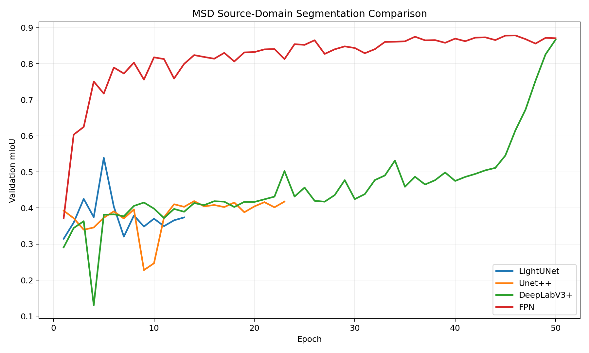
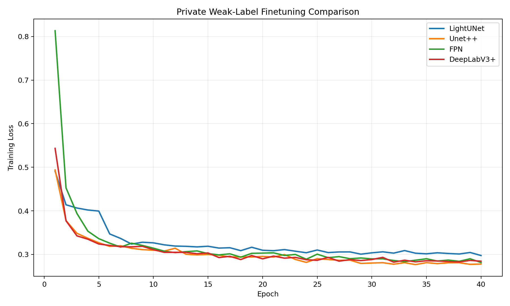
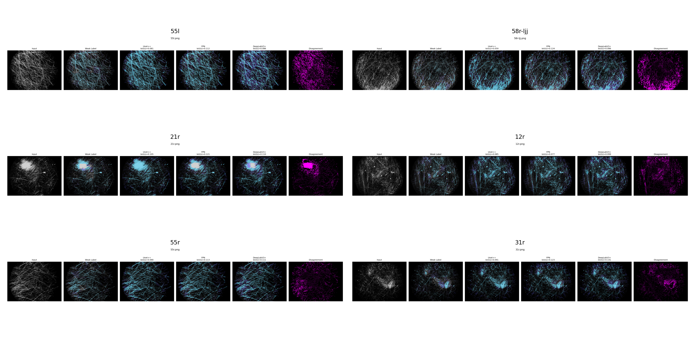
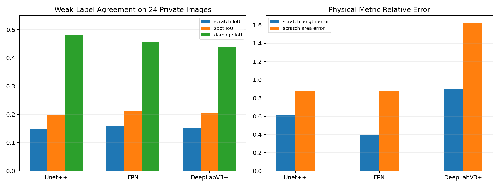

# 研究实验日志 — Phase 3C：分割实验结果分析与可视化核查

**日期**：2026-03-25  
**阶段目标**：对 Phase 3 分割分支的首轮完整实验进行结果分析，并形成可复用的人工核查与量化指标体系。  
**关联目录**：`output/experiments/phase3_segmentation/analysis/segmentation_review_20260325/`

---

## 一、阶段概况

本轮工作已经完成三件事：

1. 对 `LightUNet / Unet++ / DeepLabV3+ / FPN` 的 `MSD` 源域预训练结果进行统一整理。
2. 对 `LightUNet / Unet++ / DeepLabV3+ / FPN` 的私有弱标签微调过程进行统一整理。
3. 从私有弱标签数据中抽取 `24` 张代表性图像，使用 `Unet++ / FPN / DeepLabV3+` 三个模型并列可视化，分析彼此差异，并增加面向物理意义和标注更新的量化指标。

本轮分析脚本：

- `scripts/analyze_segmentation_results.py`

本轮核心产物：

- 结构化汇总：`output/experiments/phase3_segmentation/analysis/segmentation_review_20260325/summary.json`
- 私有图像并列核查图：`output/experiments/phase3_segmentation/analysis/segmentation_review_20260325/panels/`
- 量化表：`source_summary.csv`、`private_finetune_summary.csv`、`private_review_metrics.csv`、`private_review_aggregate.csv`

---

## 二、源域预训练结果

源域 `MSD` 预训练的主排序指标仍然采用 `val_mIoU`，同时结合日志中的 `scratch IoU / spot IoU / quick mIoU`。

| 模型 | 运行轮数 | 最佳 Epoch | 最佳 val_mIoU | scratch IoU | spot IoU | quick mIoU |
|---|---:|---:|---:|---:|---:|---:|
| LightUNet | 13 | 5 | 0.5393 | 0.3837 | 0.5855 | 0.3231 |
| Unet++ | 23 | 14 | 0.4191 | 0.6632 | 0.8404 | 0.5012 |
| DeepLabV3+ | 50 | 50 | 0.8669 | 0.8174 | 0.8827 | 0.8501 |
| FPN | 50 | 46 | 0.8787 | 0.8201 | 0.8907 | 0.8554 |

可以明确得到：

- `FPN ≈ DeepLabV3+ >> Unet++ > LightUNet`
- `LightUNet` 作为轻量基线可保留，但已经不是后续主推结构
- `FPN` 和 `DeepLabV3+` 在 clean mask 条件下学习能力最强



### 结果解释

这个排序和任务特性是匹配的。暗场图像中的划痕和污染并不是独立小目标，而是同时依赖：

- 局部边界响应
- 线状连通性
- 周围散射背景
- 跨尺度上下文

因此，多尺度语义建模更强的 `FPN / DeepLabV3+` 在源域 clean-mask 数据上表现更好，是合理结果。

---

## 三、私有弱标签微调结果

私有数据当前仍以弱标签为主，因此这一轮主要比较训练收敛性和后续人工核查表现。

| 模型 | 运行轮数 | 最佳 Epoch | 最佳 loss | 最终 loss |
|---|---:|---:|---:|---:|
| LightUNet | 40 | 40 | 0.2974 | 0.2974 |
| Unet++ | 40 | 34 | 0.2766 | 0.2779 |
| FPN | 40 | 40 | 0.2813 | 0.2813 |
| DeepLabV3+ | 40 | 32 | 0.2822 | 0.2844 |

可以看到：

- `Unet++` 的私有弱标签微调 loss 最优
- `FPN` 与 `DeepLabV3+` 接近，但略逊于 `Unet++`
- `LightUNet` 明显落后



### 结果解释

这说明一个很关键的现象：

- 在源域 clean mask 上最强的结构，不一定在目标域弱标签下也最强
- `Unet++` 的嵌套跳连结构，对细长划痕和边界噪声更稳
- `FPN / DeepLabV3+` 虽然在 clean-source 学得更强，但遇到弱标签时更容易出现面积扩张或几何偏移

这意味着后续不能只按 `MSD` 排名决定目标域主结构，而必须结合私有数据上的人工核查与物理量稳定性。

---

## 四、24 张私有图像并列可视化核查

从 `197` 张私有弱标签图像中，按混合缺陷丰富度、`scratch` 占比、`spot+damage` 占比三类规则抽取了 `24` 张代表图像，分别用：

- `Unet++`
- `FPN`
- `DeepLabV3+`

进行全图滑窗分割推理，并与弱标签做并列对照。

代表性样本总览如下：



详细单图输出目录：

- `output/experiments/phase3_segmentation/analysis/segmentation_review_20260325/panels/`

差异最明显的样本主要包括：

- `55l.png`
- `58r-ljj.png`
- `21r.png`
- `12r.png`
- `55r.png`
- `31r.png`

这些图像的共同特点是：

- `scratch` 和 `damage` 区域存在竞争关系
- `FPN / DeepLabV3+` 往往更容易给出大面积连续区域
- `Unet++` 相对更偏向保留细长结构

---

## 五、增加的详细量化指标

为了把“模型好不好”转化成“是否适合后续标注更新和物理评分”，本轮新增三类指标。

### 5.1 结构一致性指标

- `scratch IoU`
- `scratch Dice`
- `spot IoU`
- `damage IoU`
- `pixel accuracy`

说明：

- `IoU` 适合观察整体重叠质量
- `Dice` 对细长目标更友好，能补足轻微位置偏差导致的 IoU 过低问题
- `pixel accuracy` 只能作辅指标，不能单独用于判断，因为背景像素占比过大

### 5.2 多模型核查指标

- `consensus ratio`
- `pairwise disagreement ratio`

说明：

- `consensus ratio` 用于识别三模型高一致区域
- `pairwise disagreement ratio` 用于挑选人工复核优先样本

注意：本轮 `24` 张图像的平均 `consensus ratio = 0.9433`，表面上很高，但这主要来自背景区域占绝大多数。  
因此后续标注更新不能只看全图一致率，必须重点看缺陷区域内部的一致性和物理量误差。

### 5.3 物理量与标注更新指标

系统当前已统一采用 `6.8 um/pixel = 0.0068 mm/pixel`，因此本轮新增：

- `scratch_length_mm`
- `scratch_avg_width_mm`
- `scratch_area_mm2`
- `spot_area_mm2`
- `damage_area_mm2`
- `scratch_components`
- `scratch_length_error`
- `scratch_area_error`
- `spot_area_error`
- `damage_area_error`

这些指标的意义是：

- `scratch_length_mm`：更接近真实磨损轨迹长度
- `scratch_avg_width_mm`：辅助判断划痕深浅与扩展程度
- `scratch_area_mm2`：反映总体受损面积
- `components`：反映模型是否把一条划痕过度打散，或把多个区域错误粘连
- `*_error`：用于评估模型是否适合反向辅助更新弱标签

---

## 六、24 张私有图像的量化汇总

| 模型 | scratch IoU | scratch Dice | spot IoU | damage IoU | pixel accuracy | consensus ratio | scratch length error | scratch area error |
|---|---:|---:|---:|---:|---:|---:|---:|---:|
| Unet++ | 0.1479 | 0.2541 | 0.1969 | 0.4818 | 0.9382 | 0.9433 | 0.6160 | 0.8721 |
| FPN | 0.1593 | 0.2721 | 0.2126 | 0.4562 | 0.9396 | 0.9433 | 0.3954 | 0.8790 |
| DeepLabV3+ | 0.1514 | 0.2606 | 0.2053 | 0.4375 | 0.9272 | 0.9433 | 0.9013 | 1.6245 |

对应图表如下：



### 结果解读

#### 1. 弱标签一致性显著低于源域 clean-mask

虽然 `MSD` 上 `FPN / DeepLabV3+` 的 `scratch IoU` 已经达到 `0.82` 左右，但在私有图像弱标签核查中，三者的 `scratch IoU` 都只有 `0.15` 左右。

这不是模型突然“失效”，更可能说明：

- 当前私有弱标签本身存在显著噪声
- 私有 `damage` 与 `scratch` 的边界定义还不稳定
- 直接用弱标签 IoU 评价，会低估模型对真实物理形态的拟合能力

#### 2. `FPN` 在弱标签核查中最均衡

从这 24 张图的均值看：

- `FPN` 的 `scratch IoU / scratch Dice / spot IoU` 都略优
- `scratch_length_error` 最低（`0.3954`）
- 说明 `FPN` 当前对弱标签的几何偏差控制最稳

这意味着，如果目标是**先做标注更新辅助**，`FPN` 是当前较均衡的候选。

#### 3. `Unet++` 仍然是“细长结构友好”的重要候选

虽然这轮弱标签核查中 `FPN` 的均值略高，但结合私有微调 loss 和单图观察，`Unet++` 仍有两个优势：

- 对细长划痕更保守，不容易无限扩张
- 对细碎连通结构的保留更自然

因此，如果目标是**后续与骨架长度、评分体系结合**，`Unet++` 仍值得继续保留为主候选。

#### 4. `DeepLabV3+` 当前存在面积过扩张倾向

`DeepLabV3+` 的：

- `scratch_length_error = 0.9013`
- `scratch_area_error = 1.6245`

都显著高于另外两个模型，说明它在当前私有弱标签场景下更容易把划痕和大面积散射区域“吃进去”，形成过扩张。

这在物理上是有风险的，因为：

- 会高估缺陷面积
- 会影响后续评分
- 会误导标注更新，把本来需要分开的区域合并

---

## 七、物理意义讨论

### 7.1 为什么分割比 bbox 更接近任务本体

暗场镜片缺陷的成像本质是散射增强，不同缺陷在图像中的真实表现是：

- 细长线状区域（划痕）
- 局部亮斑区域（油污、斑点）
- 大面积不规则区域（损伤）

因此真正有物理意义的量不是矩形框，而是：

- 真实长度
- 实际面积
- 平均宽度
- 连通性
- 是否进入关键区域

分割路线天然比检测路线更适合承接这些量。

### 7.2 为什么本轮要引入 `mm / mm²`

当前比例尺为 `6.8 um/pixel`，这意味着：

- `100 px` 的骨架长度约等于 `0.68 mm`
- `10,000 px²` 的面积约等于 `0.4624 mm²`

一旦分割结果稳定，后续就可以直接构建：

- 划痕总长度 `L_total`
- 中心区划痕长度 `L_center`
- 缺陷数量 `N`
- 缺陷面积 `A`
- 散射强度 `S_scatter`

这和当前评分体系是天然衔接的。

### 7.3 为什么弱标签 IoU 低，不代表分割路线失败

当前低 IoU 更大的可能是：

- 弱标签来源于传统检测/规则，先天边界不精确
- `scratch / damage` 的定义边界存在口径混叠
- 人工尚未建立统一的像素级判定标准

因此，本轮分割实验最重要的价值不只是“分数”，而是为后续建立：

- 更稳的标注更新流程
- 更物理可信的评分量化

打下了基础。

---

## 八、阶段结论

本轮可以收敛出以下结论：

1. 分割分支已经从“可行性验证”进入“正式研发可推进”阶段。
2. `FPN / DeepLabV3+` 在 `MSD` clean-mask 上最强，说明多尺度上下文对暗场缺陷分割非常关键。
3. `Unet++` 在私有弱标签微调上最稳，说明它对细长结构和弱标签噪声更友好。
4. `FPN` 在 24 张私有图量化核查中最均衡，适合作为当前标注更新辅助候选。
5. `DeepLabV3+` 当前有明显面积扩张风险，不适合直接作为标注更新主模型。
6. 仅看全图 `pixel accuracy / consensus ratio` 会被背景主导，后续必须转向缺陷区域与物理量指标。

---

## 九、下一步建议

1. 以 `FPN + Unet++` 为双候选，继续做更细的私有图人工核查。
2. 将 `FPN` 优先用于弱标签提质和标注更新辅助。
3. 将 `Unet++` 优先用于后续骨架长度、面积、评分体系耦合。
4. 在后续核查中增加“缺陷区内一致率”和“中心区/微结构区物理量误差”。
5. 等标注更新完成后，再做一次新的私有分割验证，检验当前低 IoU 是否主要来自弱标签噪声。

---

## 十、复现实验命令

```bash
MPLCONFIGDIR=/tmp/mplconfig UV_CACHE_DIR=/tmp/uv-cache uv run --no-sync python scripts/analyze_segmentation_results.py \
  --sample-count 24 \
  --device cuda
```

如果当前环境拿不到 GPU，可临时改为：

```bash
MPLCONFIGDIR=/tmp/mplconfig UV_CACHE_DIR=/tmp/uv-cache uv run --no-sync python scripts/analyze_segmentation_results.py \
  --sample-count 24 \
  --device cpu
```
