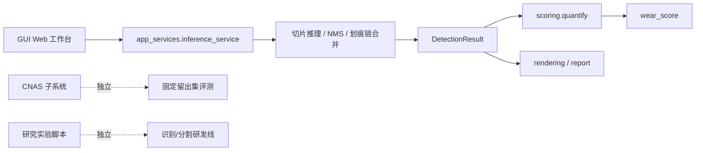

# 暗场离焦微结构镜片缺陷检测系统研究技术文档

## 1. 文档定位

本文档面向当前项目的技术接手、阶段汇报与后续研发迭代，聚焦以下三个问题：

1. 当前预发布系统是否已经形成稳定主线
2. 当前底层识别算法与分割算法的逻辑关系、实验结论与改进方向
3. 当前系统在物理量化、评分理论和测试隔离后的整体技术状态

## 2. 当前系统结论

当前系统已经具备 `v0.1-pre` 级别的预发布条件，但仍应明确其边界：

- 主体入口已经收敛为 GUI 工作台
- 后端主线已经收敛为“全图推理服务 + 统一评分 + 独立 CNAS 测试”
- 日常研发与第三方测试已解耦
- 物理尺度已经纳入系统，尺寸口径默认切换为 `mm`

当前不再建议把训练脚本、CNAS 测试脚本和研究性改模逻辑直接视为“正式系统的一部分”。

## 3. 当前预发布架构

### 3.1 主体功能

当前 GUI 预发布主线由五部分构成：

1. 图像输入
2. 全图推理
3. 缺陷可视化
4. 统一评分与评级
5. 结果导出

### 3.2 当前主架构

### 3.3 当前界面示意

下图为依据当前 GUI 主线和现有实验产物整理的界面快照，用于说明当前预发布版本的结构与信息布局。

## 4. 物理尺度接入

### 4.1 当前标定口径

当前系统已将图像比例尺纳入统一配置：

- `6.8 um/pixel`
- 即 `0.0068 mm/pixel`

因此，系统内所有面对用户的长度、宽度、面积输出，默认切换为：

- 长度单位：`mm`
- 面积单位：`mm²`

### 4.2 当前实施原则

本轮改造没有推翻底层像素级算法，而是采用“内部仍按像素计算、对外统一转物理单位”的策略：

- 检测与分割内部逻辑仍使用像素坐标
- `DetectionResult / DefectInstance` 增加物理量属性
- GUI、汇总面板、HTML 报告、JSON/CSV/JSONL 导出默认展示 `mm/mm²`
- 原始像素量继续保留在 `raw_px` 字段中，便于后续实验与审计

这种改法的好处是：

- 不影响现有算法稳定性
- 能立即统一系统的业务口径
- 方便后续将评分理论与行业尺寸标准直接挂钩

## 5. 识别算法主线与实验结论

### 5.1 当前正式基线

当前识别算法的正式基线仍然是：

- 权重：`output/training/stage2_cleaned/weights/best.pt`
- 固定留出集规模：`20` 张原图，`860` 个切片

`stage2_cleaned` 在训练过程中的主曲线如下。

固定留出集上的总体结果如下：

| 实验 | mAP@0.5 | mAP@0.5:0.95 | Precision | Recall | Scratch AP@0.5 | Spot AP@0.5 | Critical AP@0.5 |
|---|---:|---:|---:|---:|---:|---:|---:|
| A0_baseline | 0.6765 | 0.4541 | 0.5997 | 0.6735 | 0.4525 | 0.8180 | 0.7589 |
| C1_ssgd_finetune | 0.6755 | 0.4353 | 0.5875 | 0.6716 | 0.4409 | 0.8266 | 0.7591 |
| C1_ssgd_freeze10 | 0.0000 | 0.0000 | 0.0000 | 0.0000 | 0.0000 | 0.0000 | 0.0000 |
| B1_sfe_only | 0.6262 | 0.4020 | 0.5575 | 0.6347 | 0.4062 | 0.7767 | 0.6956 |
| B2_nwd_only | 0.6802 | 0.4500 | 0.6080 | 0.6641 | 0.4488 | 0.8377 | 0.7542 |
| B3_sfe_nwd | 0.5856 | 0.3603 | 0.5246 | 0.6225 | 0.3811 | 0.7174 | 0.6581 |

### 5.2 当前识别算法改进结论

当前最明确的结论有四点：

1. `stage2_cleaned` 仍然是当前正式主线
2. `NWD-only` 是当前唯一在固定留出集上略优于 baseline 的结构改进
3. `SFE-only` 和 `SFE+NWD` 在当前实现下没有形成稳定正收益
4. `SSGD` 迁移学习路线目前更像“未打通”，而不是“已被证明有效”

识别算法对比图如下。

### 5.3 当前识别主线的技术判断

识别算法当前的真实优势来自：

- 标注清洗
- 伪标签补漏
- 全图后处理链路
- 固定留出集评测约束

而不是来自一次性换更复杂的模型结构。

这说明当前识别分支更适合采用：

- 小步、单变量、固定预算的自动化实验方法
- 每次只改一个主变量
- 按固定留出集复评决定是否保留

## 6. 分割算法分支与第一阶段实验

### 6.1 分割分支定位

分割分支的目标不是立即替代正式检测系统，而是建立一条独立研发线，用于解决当前 bbox 路线的三个先天短板：

1. 细长划痕的 IoU 脆弱性
2. 切片边界导致的碎片化监督
3. 后续长度、面积、骨架等物理量分析缺少 mask 支撑

### 6.2 当前实现状态

当前分割分支已经具备以下基础能力：

- `LightUNet` 轻量基线
- 分割模型工厂，可扩展 `Unet++ / DeepLabV3+ / FPN`
- `MSD` 公开数据预训练入口
- 私有弱标签微调入口
- 全图滑窗分割推理
- `mask -> DetectionResult` 桥接

### 6.3 第一阶段实验结论

当前已经完成的第一阶段实验是：

- 数据集：`MSD`
- 模型：`LightUNet`
- 预算：`60` 分钟
- 设备：`CUDA / RTX 4090D`

实验摘要如下：

| 项目 | 数值 |
|---|---:|
| 训练集 patch 数 | 7680 |
| 验证集 patch 数 | 960 |
| 参数量 | 20.55M |
| 最佳 `val_mIoU` | 0.5393 |
| 预算结束后快速验证 `scratch IoU` | 0.3837 |
| 预算结束后快速验证 `spot IoU` | 0.5855 |
| 预算结束后快速验证 `mIoU` | 0.3231 |

这说明当前分割训练链路已经打通，但第一轮结果仍然只能视为：

- `MSD` 源域基线
- 不是最终结论
- 更不能直接代表私有数据上的最终效果

### 6.4 与当初改模逻辑的一致性

这条实验逻辑与前期改模研究是一致的，但口径比之前更清楚：

- `MSD` 仅用于源域结构预训练与结构排序
- 当前私有数据只作为目标域训练验证数据
- `CNAS` 留出 20 图像不再参与日常分割实验决策

也就是说，分割分支现在已经真正从“测试导向”切换成“研发导向”。

## 7. 评分理论的当前状态

### 7.1 当前统一口径

评分逻辑已经统一到：

- 区域逻辑：`center / microstructure / edge`
- 主指标框架：`L_center / L_total / N / A / S_scatter`

其中：

- `center` 对应主视觉中心区
- `microstructure` 对应离焦微结构关键功能区
- `edge` 对应边缘低敏感区域

### 7.2 当前评分实现特点

当前评分不是简单按缺陷数量打分，而是体现了功能区域权重：

- 中心区优先级最高
- 微结构区次高
- 边缘区权重最低
- 严重缺陷额外惩罚

在本轮改造后，评分相关长度与面积的对外展示单位也已统一到物理单位，这使后续评分理论能够进一步向行业尺寸标准靠拢。

## 8. 当前预发布系统的完整度判断

### 8.1 已具备的条件

当前系统已经具备第一预发布版本的主体条件：

- GUI 主入口明确
- 全图推理闭环稳定
- 评分实现统一
- 物理尺度口径已统一
- CNAS 测试链路已独立
- 日常研发与正式测试已分离

### 8.2 仍需继续补齐的非阻断项

以下问题不妨碍当前进入 `v0.1-pre`，但应在下一轮继续完善：

- GUI 批量导出与批处理服务仍不够完整
- 分割分支还未形成正式结构对照结论
- `LightUNet` 训练结束日志出现一次 `free(): invalid next size (fast)`，需要继续排查训练进程退出阶段的稳定性
- 评分理论还可以进一步与行业标准尺寸阈值绑定

## 9. 后续研发建议

### 9.1 识别算法分支

- 正式系统继续冻结 `stage2_cleaned`
- 识别研发线以 `NWD-only` 为父实验继续推进
- 严格采用单变量自动化实验方法

### 9.2 分割算法分支

- 紧接着运行 `Unet++` 对照实验
- 保持与 `LightUNet` 相同预算、相同数据、相同设备
- 第一轮先完成 `LightUNet / Unet++ / DeepLabV3+ / FPN` 四模型源域排名

### 9.3 系统工程

- 继续把 GUI 导出能力下沉到 `app_services`
- 将研究脚本中的剩余产品级逻辑迁回 `src/`
- 后续所有用户侧尺寸输出继续保持物理单位优先

## 10. 结论

截至 `2026-03-24`，本项目已经从“多条实验线并行探索”进入“主系统收敛 + 研发分支独立推进”的阶段。  
当前最重要的不是再扩展更多入口，而是：

- 维持 GUI 预发布主线的稳定性
- 保持识别与分割两条研发线的实验纪律
- 用统一的物理量和评分口径，逐步把系统从“能检测”推进到“能解释、能量化、能交付”
