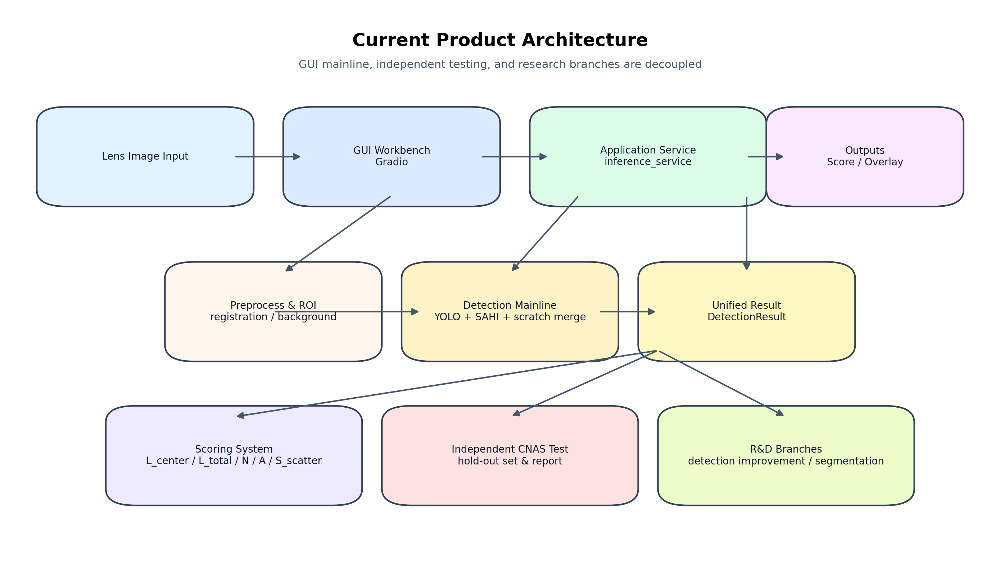
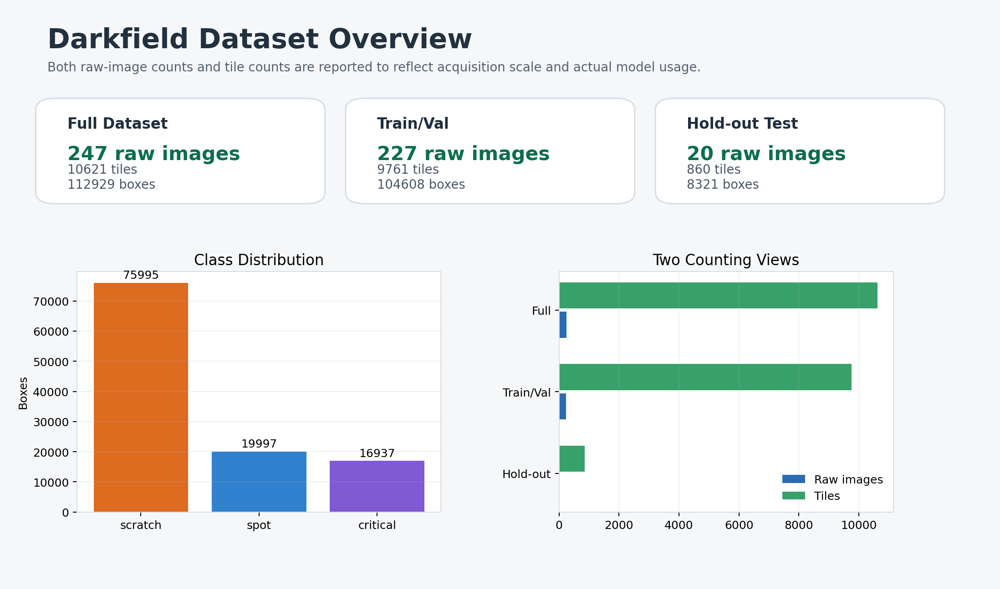
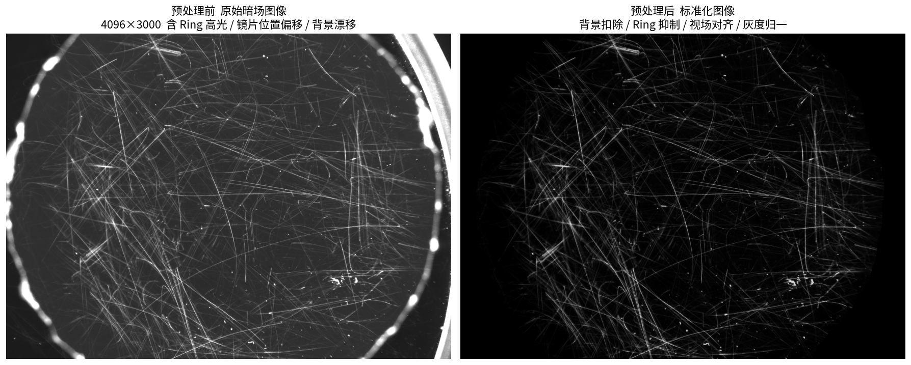
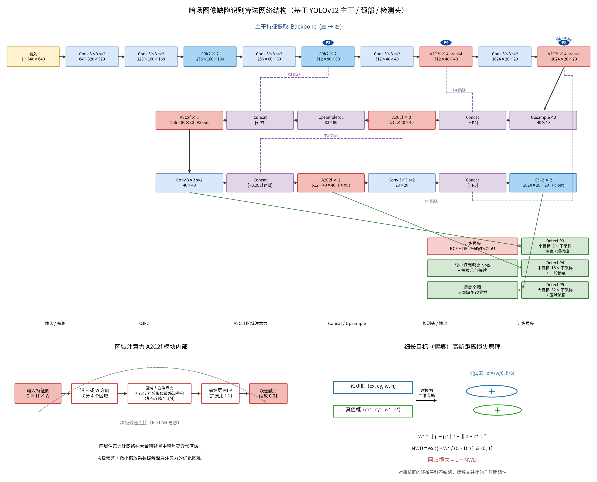
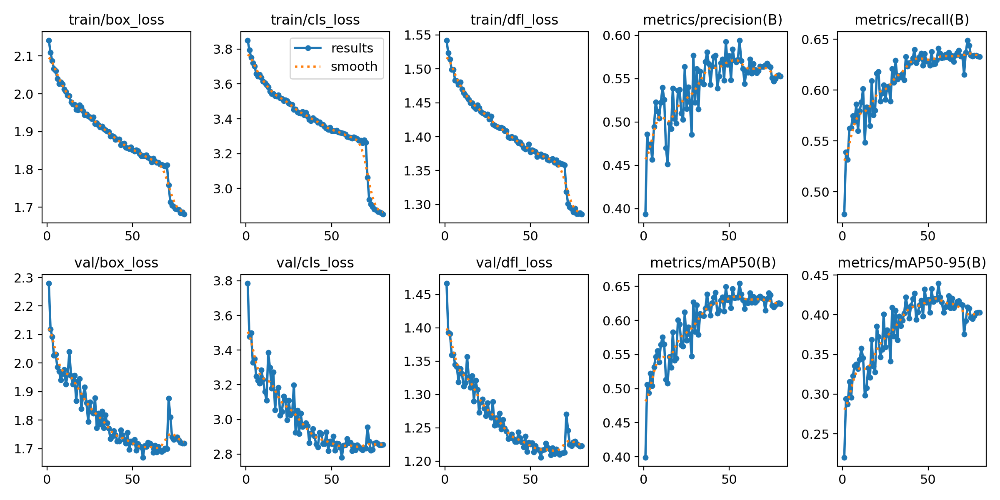
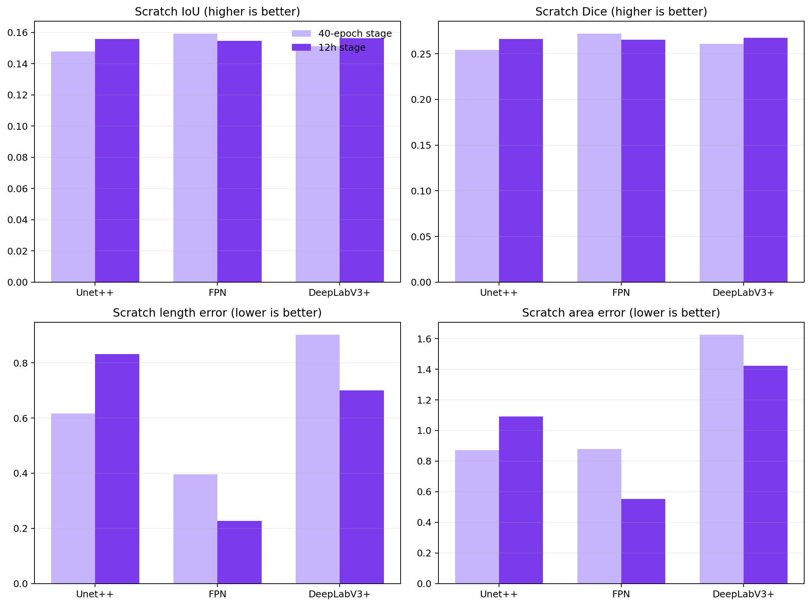
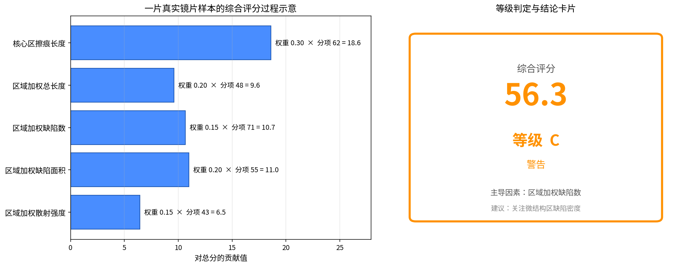
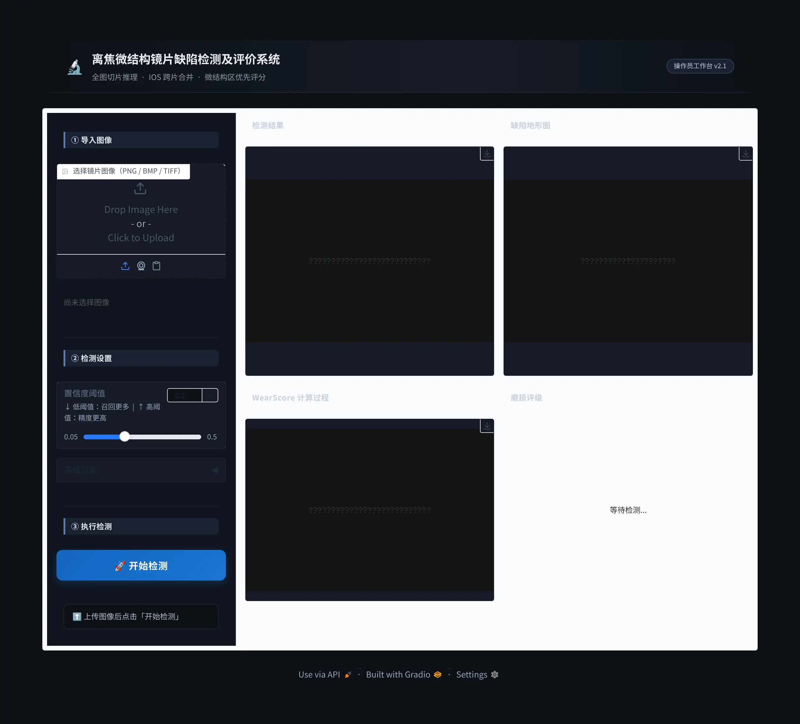

# 暗场镜片缺陷检测系统 — 模块化架构梳理

> 版本：v1.0（2026-05-31）　|　视角：暗场图像缺陷识别算法开发　|　状态：阶段性成果，整体架构定型

本文从**算法开发**视角，把项目拆解为 8 个相对独立、接口清晰的模块：数据集 → 预处理 → 半监督标注 → 识别算法 → 分割算法 → 评估算法 → 前端系统 → 第三方测试。每个模块给出**职责、关键代码路径、输入·输出、当前状态**，便于协作者按模块接手。



---

## 0. 总览：双主线 + 八模块

系统收敛为两条主线：

- **GUI 预发布主线** —— 面向非专业用户，单张镜片图像 → 缺陷检测 → 评分评级 → 结论（模块 ②④⑥⑦）。
- **研发与测试分支** —— 识别/分割算法改进、半监督标注迭代、独立 CNAS 第三方测试（模块 ①③④⑤⑥⑧）。

数据流主链：

```text
原始暗场图像 ──①数据集──▶ ②预处理(ROI/亮度/配准) ──▶ ④识别(YOLO+SFE+NWD) ──┐
                                          └──▶ ⑤分割(HRNet-OCR/SegFormer) ──┤
                                                                            ▼
                                              ⑥评估(mAP / WearScore 评级) ──▶ ⑦前端展示
                                                                            ▲
                              ③半监督标注(伪标签/弱标签) ──回流──▶ ①数据集     │
                                                                  ⑧CNAS 第三方测试
```

---

## ① 数据集模块

**职责**：管理暗场镜片原始图像、ROI 切片（tile）数据集、训练/验证/测试划分与清单（manifest）。

**关键路径**

- 数据根目录：`output/dataset_v2/`（247 张全镜片图像 + 标定件，**不入 Git**）
- 切片数据集构建：`scripts/build_tile_dataset.py`（640×640，stride 480）
- 数据加载抽象：`src/darkfield_defects/data/{dataset.py,loader.py}`
- 分割数据集准备：`scripts/prepare_msd_segmentation.py`、`prepare_ssgd_yolo.py`
- 测试集清单：`cnas_test/manifests/test_set_v1.json`（860 tiles）

**输入·输出**：原始 `.png` 镜片图 → 切片 + YOLO 格式标签 + 数据集 yaml/manifest。

**当前状态**：`dataset_v2` 为生产基线数据；3 类缺陷 `scratch / spot / critical`。数据与代码物理分离，仅清单与模板入库。



---

## ② 预处理模块

**职责**：把成像条件不一致的暗场原图，归一化为可比、可检测的标准输入——抑制高光环、统一亮度、配准到模板坐标系、提取有效 ROI。

**关键路径**：`src/darkfield_defects/preprocessing/`

| 子模块 | 作用 |
|---|---|
| `background_fusion.py` | 多张背景平均 → 生成离焦模糊模板 |
| `roi_builder.py` | 高光 ring 结构掩膜 → 构建有效 ROI |
| `registration.py` | 高光 ring 模板匹配（平移+旋转+缩放 ≤5%） |
| `brightness_correction.py` | 线性亮度修正 + 图像最终化 |
| `circle_fitting.py` / `arc_extraction.py` | 圆/弧几何拟合，定位镜片边界 |
| `pipeline.py` | 编排：标定阶段 + 处理阶段，产出可复现的预处理结果 |

**输入·输出**：原始暗场图 + 背景图集 → ROI 掩膜 + 亮度修正后的标准图（含 JSON 元数据）。

**当前状态**：流水线稳定，已用于全量数据；标定与处理两阶段分离，参数可复现。



---

## ③ 半监督标注模块

**职责**：在有限人工标注下，通过标签清洗、伪标签、弱标签扩充训练数据，并对标注质量做审计回流。

**关键路径**（脚本化迭代，`scripts/`）

- `step1_label_cleanup.py` → `step2_pseudo_labels.py` → `step3_retrain.py` → `step4_compare.py` → `step5_retrain.py`：标注-训练闭环
- `generate_weak_masks.py`：分割弱标签生成（私有数据）
- `audit_stage2_labels.py`、`relabel_merge_critical.py`：标注审计与关键类合并
- 产物：`output/pseudo_labels/`（**不入 Git**）

**输入·输出**：人工标注 + 模型预测 → 清洗后标签 / 伪标签 / 弱掩膜 → 回流至 ① 数据集。

**当前状态**：检测伪标签闭环（stage1 → stage2_cleaned）已固化为生产基线；分割弱标签已生成并用于私有微调。

---

## ④ 识别算法模块（检测）

**职责**：在切片上检测三类缺陷并定位，是生产主线核心。基于 **YOLOv12m**，并探索 SFE（浅层特征增强）与 **NWD**（Normalized Wasserstein Distance）检测头改进。

**关键路径**

- 检测引擎与特征：`src/darkfield_defects/detection/`（classical, features, preprocess, rendering, params）
- ML 训练/推理：`src/darkfield_defects/ml/{models,sfe_modules,nwd_loss,train,predict}.py`
- 改进训练入口：`scripts/train_phase2_sfe_nwd.py`、`train_stage1_baseline.py`
- 全图推理流水线：`scripts/infer_full_pipeline.py`（SAHI 切片 → IOS-NMS → `connect_scratches` 链接 → WearScore）

**输入·输出**：标准切片 → 缺陷框（类别+置信度+坐标）→ 全图拼接框链。

**当前状态（基线，CNAS 测试集 2026-03-22）**

| 指标 | 值 |
|---|---|
| mAP@0.5 | **0.6765**（通过 ≥60% 目标） |
| scratch AP | 0.4525（最大短板） |
| spot AP | 0.8180 |
| critical AP | 0.7589 |

> Phase 3B 检测头改进（SFE/NWD/SSGD 微调）经全量实验，**均未超越基线 scratch AP**；FN 分析定位根因为**低对比度图像域偏移**（非 bbox 几何问题），后续转向数据级对比度增强。生产部署仍采用基线权重 `output/training/stage2_cleaned/weights/best.pt`。




---

## ⑤ 分割算法模块

**职责**：像素级刻画缺陷形态（划痕、凹坑、大面积裂纹），为重叠缺陷结构解析与精细评分提供基础。研发分支，未进入生产主线。

**关键路径**

- 分割工厂与模型：`src/darkfield_defects/ml/{segmentation_factory.py,hrnet_ocr.py,models.py}`（含 LightUNet 4 类基础模型）
- mmseg 配置模板：`configs/segmentation/mmseg/`（HRNet-OCR-W18 / HRNetV2-W18 / SegFormer-B2，各含 MSD 与 private 两套）
- 训练入口：`scripts/train_msd_segmentation.py`、`train_private_segmentation.py`、`train_mmseg_experiment.py`
- 实验范式：MSD 公共数据预训练 → 私有弱标签微调 → 桥接评审（`run_bridge_review.py`）

**输入·输出**：切片 → 缺陷分割掩膜（多类）→ 形态特征（供评估/重叠缺陷解析）。

**当前状态**：MSD 预训练 + 私有微调完成；多模型对比与可视化核查完成（Phase 3C–3F）。已可经 `infer_full_pipeline.py --use-segmentation` 集成，但未作为普通用户主线默认开启。



---

## ⑥ 评估算法模块

**职责**：两层评估——（a）算法精度评估（mAP / AP / 混淆矩阵）；（b）业务级 **WearScore 磨损评分与评级**，把检测/分割结果换算为可解释的 A/B/C/D 等级与结论。

**关键路径**

- 检测精度指标：`src/darkfield_defects/eval/metrics.py`、`scripts/compare_experiments.py`、`eval_utils.run_cnas_eval()`
- 磨损量化与评分：`src/darkfield_defects/scoring/{quantify.py,wear_score.py,report.py}`
- CNAS 固定评估参数：`conf=0.001, iou=0.6`，860 tiles

**WearScore 评分链路**：五项贡献因子加权 → 总分 → 等级

| 贡献因子 | 含义 | 权重 |
|---|---|---|
| center_length | 中心区划痕 | 0.30 |
| effective_length | 区域加权长度 | 0.20 |
| defect_area | 区域加权面积 | 0.20 |
| defect_count | 区域加权缺陷数 | 0.15 |
| scatter_intensity | 区域加权散射 | 0.15 |

**等级阈值**（2026-03-22）：A < 25，B < 50，C < 80，D ≥ 80。

**输入·输出**：缺陷框/掩膜 → 精度指标（评测）/ 磨损分+等级+结论（业务）。



---

## ⑦ 前端系统模块

**职责**：面向非专业操作员的工作台。四步流程：导入镜片图像 → 执行缺陷检测 → 查看四联结果（检测叠加图 / 缺陷地形图 / 评分过程图 / 评级卡片）→ 得到分析结论。

**关键路径**

- GUI 主程序：`src/darkfield_defects/viz/app.py`（Gradio，左控制面板 25% + 右 2×2 结果网格 75%）
- 应用服务层：`src/darkfield_defects/app_services/inference_service.py`（`run_full_image_inference`、`get_default_weights_path`）
- 默认权重：`output/experiments/phase3e/detection_training/b2_nwd_only_phase3e/weights/best.pt`

**启动**

```bash
uv run python -m darkfield_defects.viz.app   # http://127.0.0.1:7860
```

**输入·输出**：单张镜片图像 → 检测叠加图 + 缺陷地形图 + WearScore 计算过程 + A/B/C/D 评级卡。

**当前状态**：预发布主线，四步流程可用；不含批量处理、训练入口、研究脚本、CNAS 执行入口。



---

## ⑧ 第三方测试模块（CNAS）

**职责**：独立、可复现的第三方算法准确率测试子系统，产出符合 CNAS 留痕要求的测试报告与见证材料。与生产系统解耦，单独运行。

**关键路径**：`cnas_test/`

| 子目录 | 内容 |
|---|---|
| `runner/` | 评测主流程：`run_eval.py`、`evaluator.py`、`dataset_loader.py`、`report*.py`、`provenance.py`、`screenshot.py` |
| `manifests/` | 测试集清单（`test_set_v1.json`、`full_dataset_v1.json`） |
| `templates/` | 测试大纲/报告模板 |
| `tools/` | Word 同步、环境记录、报告构建工具 |
| `outputs/` | 评测运行产物（**不入 Git**，归档保存） |

**运行**

```bash
uv run python -m cnas_test.runner.run_eval --help
```

**输入·输出**：固定测试集 + 待测权重 → 评测指标 JSON + Markdown/HTML/Word 报告 + 过程截图与溯源信息。

**当前状态**：评测流程、报告生成、过程留痕、溯源（provenance）均已实现并跑通；测试结果与交付件归档于 `output/_doc_archive/` 与 `cnas_test/outputs/`。

---

## 模块接口与依赖一览

| 模块 | 上游输入 | 下游输出 | 入 Git |
|---|---|---|---|
| ① 数据集 | 原始暗场图 | 切片+标签+清单 | 仅清单/模板 |
| ② 预处理 | 原图+背景 | 标准图+ROI | ✅ 代码 |
| ③ 半监督标注 | 标注+预测 | 伪/弱标签 | ✅ 脚本 |
| ④ 识别 | 标准切片 | 缺陷框链 | ✅ 代码 |
| ⑤ 分割 | 切片 | 缺陷掩膜 | ✅ 代码/配置 |
| ⑥ 评估 | 框/掩膜 | 指标+评级 | ✅ 代码 |
| ⑦ 前端 | 单张镜片图 | 四联结果+结论 | ✅ 代码 |
| ⑧ 第三方测试 | 测试集+权重 | 报告+留痕 | ✅ 代码/模板 |

**统一约定**：数据集、训练输出、实验产物、权重、评测运行产物、归档文档均位于 `output/` 与 `runs/`，默认不入 Git；仓库仅同步源码、配置、测试、轻量清单/模板与成果型文档。
