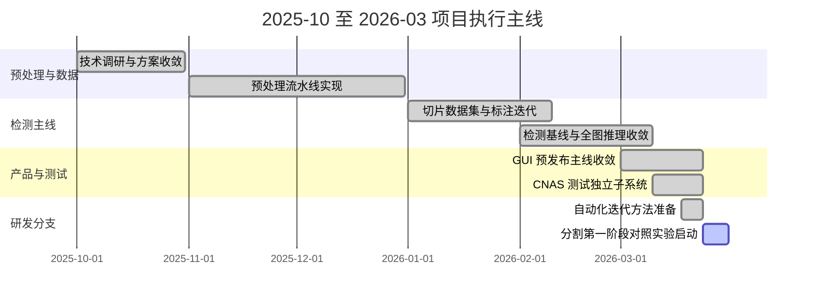
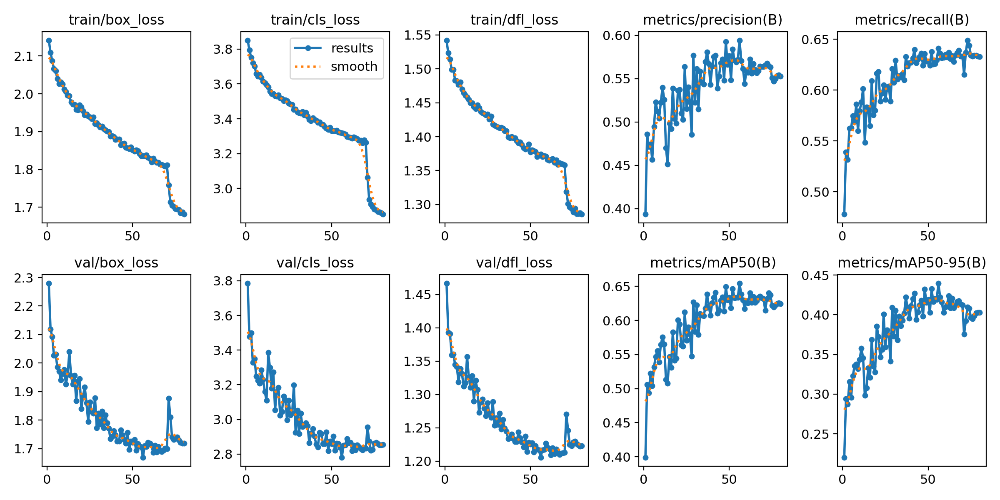
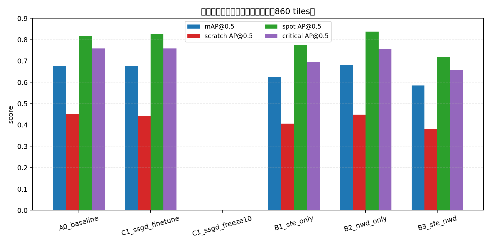
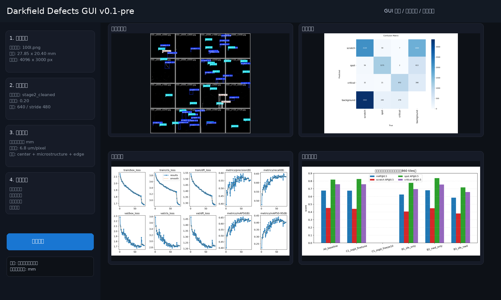

# 暗场离焦微结构镜片缺陷检测项目执行文档

## 1. 文档目的

本文档用于整理当前项目在 `2025-10` 至 `2026-03` 六个月周期内的执行主线、阶段成果、关键节点和后续承接方式，便于：

- 项目复盘
- 阶段汇报
- 任务交接
- 下一阶段研发与产品工作排期

## 2. 六个月总体结论

这六个月的工作可以概括为四个阶段：

1. 预处理与光学口径打底
2. 检测数据集建设与基线建立
3. 推理链路、评分逻辑与独立测试收口
4. 分割研发线与自动化迭代准备

截至 `2026-03`，项目已经形成：

- 一个可稳定演示和使用的 GUI 预发布主线
- 一条稳定的识别正式基线
- 一套独立的 CNAS 测试子系统
- 一条已启动的分割算法研发支线

## 3. 六个月阶段划分

### 3.1 阶段总览

| 阶段 | 时间 | 主题 | 主要输出 |
|---|---|---|---|
| Phase 0 | 2025-10 ~ 2025-11 | 需求澄清与技术路线确定 | 项目目标、技术调研、原型方向 |
| Phase 1 | 2025-11 ~ 2026-01 | 预处理流水线与图像标准化 | ROI、背景扣除、配准、数据整理 |
| Phase 2 | 2026-01 ~ 2026-02 | 切片标注、训练基线、推理修正 | `stage2_cleaned` 基线、后处理链路 |
| Phase 3 | 2026-02 ~ 2026-03 | GUI 收敛、评分统一、测试独立、分割准备 | GUI 预发布、CNAS 子系统、分割实验起步 |

### 3.2 里程碑甘特图

## 4. 关键阶段输出

### 4.1 预处理阶段

预处理阶段解决的是“图像能不能进入同一分析坐标系”的问题，主要完成了：

- ROI 提取
- Ring 区域利用
- 配准
- 背景扣除
- 图像标准化

相关实验与设计依据主要来自：

- `研究实验日志_20260213-0319_Phase01_预处理流水线.md`
- `背景技术综合研究报告_v1.md`

典型预处理产物示例如下。

### 4.2 检测基线阶段

检测基线阶段的核心成果不是“换了某个更大的模型”，而是：

- 完成切片数据集构建
- 完成标注清洗
- 完成伪标签补漏
- 建立 `stage2_cleaned` 正式基线

基线训练曲线如下。

### 4.3 推理与评测阶段

推理与评测阶段的核心成果是：

- 全图切片推理
- IOS NMS
- `connect_scratches`
- 固定留出集评测
- CNAS 测试子系统独立

固定留出集上的当前识别算法对比如下。

### 4.4 GUI 预发布阶段

当前 GUI 预发布主线已经形成一个完整的对外工作台：

- 输入图像
- 运行检测
- 查看结果图
- 查看评分
- 输出结论

界面结构如下图所示。

## 5. 当前阶段量化结果

### 5.1 正式识别基线

| 指标 | 数值 |
|---|---:|
| 固定留出集规模 | 20 张原图 / 860 tiles |
| Baseline `mAP@0.5` | 0.6765 |
| Baseline `mAP@0.5:0.95` | 0.4541 |
| Scratch `AP@0.5` | 0.4525 |
| Spot `AP@0.5` | 0.8180 |
| Critical `AP@0.5` | 0.7589 |

### 5.2 当前改模实验结论

| 实验 | 结论 | 说明 |
|---|---|---|
| `B2_nwd_only` | 保留观察 | 当前唯一略优于 baseline 的结构改进 |
| `B1_sfe_only` | 暂不继续 | 当前结果退化 |
| `B3_sfe_nwd` | 暂不继续 | 当前结果退化 |
| `SSGD finetune` | 暂不并入主线 | 尚未证明稳定正收益 |
| `SSGD freeze10` | 失败 | 结果失效 |

### 5.3 分割第一阶段

| 项目 | 数值 |
|---|---:|
| 模型 | `LightUNet` |
| 数据 | `MSD` |
| 预算 | 60 分钟 |
| 最佳 `val_mIoU` | 0.5393 |
| 快速验证 `scratch IoU` | 0.3837 |
| 快速验证 `spot IoU` | 0.5855 |
| 快速验证 `mIoU` | 0.3231 |

这组结果的意义在于“研发链路已打通”，不是“正式系统已经切到分割路线”。

## 6. 六个月工作分配建议

下面这张表，是把过去六个月的开发工作按更合理的项目管理视角重新归类，便于后续沿用同样的任务框架。

| 月份 | 核心目标 | 建议投入占比 | 主要责任方向 |
|---|---|---:|---|
| 2025-10 | 需求澄清、技术调研、路线比较 | 10% | 研究与方案 |
| 2025-11 | 预处理、ROI、背景扣除、配准 | 20% | 图像工程 |
| 2025-12 | 数据清洗与预处理闭环验证 | 15% | 数据工程 |
| 2026-01 | 切片标注、训练基线、伪标签 | 20% | 检测算法 |
| 2026-02 | 全图推理、评分收敛、GUI 主线 | 20% | 产品工程 |
| 2026-03 | 测试独立、分割研发线、自动化实验准备 | 15% | 系统集成 + 研发推进 |

## 7. 当前角色分工建议

为便于后续继续推进，建议当前项目按四条线分工：

| 方向 | 工作内容 | 当前优先级 |
|---|---|---:|
| 产品主线 | GUI、服务层、导出、评分展示 | P0 |
| 识别算法 | `baseline` 冻结、`NWD-only` 继续验证 | P0 |
| 分割算法 | `LightUNet / Unet++ / DeepLabV3+ / FPN` 对照 | P1 |
| 测试与交付 | `CNAS` 子系统、正式文档、第三方送检材料 | P0 |

## 8. 当前风险与应对

### 8.1 风险一：主线与研究线重新耦合

风险表现：

- GUI 重新直接依赖研究脚本
- 分割实验结果直接影响正式系统

应对方式：

- 正式系统只使用冻结基线
- 新算法必须先在研发线内完成独立验证

### 8.2 风险二：测试逻辑重新混入日常研发

风险表现：

- 20 张留出图像重新被用于日常调参
- 测试口径被频繁修改

应对方式：

- 坚持 `CNAS` 子系统独立
- 留出集只用于阶段性核验

### 8.3 风险三：评分理论与物理量脱节

风险表现：

- 系统继续用像素值与用户沟通
- 评分结果难以映射到业务认知

应对方式：

- 当前已统一默认单位为 `mm`
- 下一步继续将评分阈值与行业尺寸标准衔接

## 9. 下一阶段建议排期

### 9.1 未来两周

- 完成 `Unet++`、`DeepLabV3+`、`FPN` 第一轮对照
- 补齐 GUI 导出与批处理服务
- 整理预发布版安装/启动说明

### 9.2 未来一个月

- 固化 `v0.1-pre`
- 形成分割分支第一轮结论
- 将评分理论继续绑定物理尺寸阈值

### 9.3 未来一个季度

- 识别与分割双线结果再收敛一次
- 评估是否进入 `v0.2`
- 形成可面向第三方测试与业务展示的正式交付包

## 10. 结论

从项目执行视角看，过去六个月最有价值的工作不是“做了很多模型”，而是：

- 把图像、数据、推理、评分、测试、交付逐步拆清楚
- 明确了正式系统主线和研发实验分支
- 让系统从“研究代码集合”开始具备“可交付系统”的结构

下一阶段应坚持两条原则：

1. 正式系统继续收口，不被实验线拖乱
2. 研发分支继续加速，但必须保持实验纪律和清晰边界
